# 🌐 APIs & Asynchronous JavaScript

APIs (Application Programming Interfaces) and the Client-Server model are the backbone of the modern web. They allow developers to connect different services, fetch dynamic data, and build interactive applications. By leveraging **Asynchronous JavaScript**, we can fetch data, handle background tasks, and keep the user interface smooth and responsive.

---

## 📖 Chapter 1: What is an API?

### Core Concept

An **API (Application Programming Interface)** is a software intermediary that allows two applications to talk to each other. It allows your code to communicate with and leverage the features/data of someone else's code or service.

- **Browser/Web APIs:** Built-in tools provided directly by the web browser (e.g., `localStorage`, `fetch()`, Geolocation, DOM Manipulation).
- **Third-Party APIs:** External services run by other providers that you access over the web (e.g., BoredAPI, OpenWeatherMap, GitHub API).

### 💡 Visualizations

<details>
  <summary><b>📷 Expand to View API Visualizations & Slides</b></summary>
  <br>

### 1. What is an API?

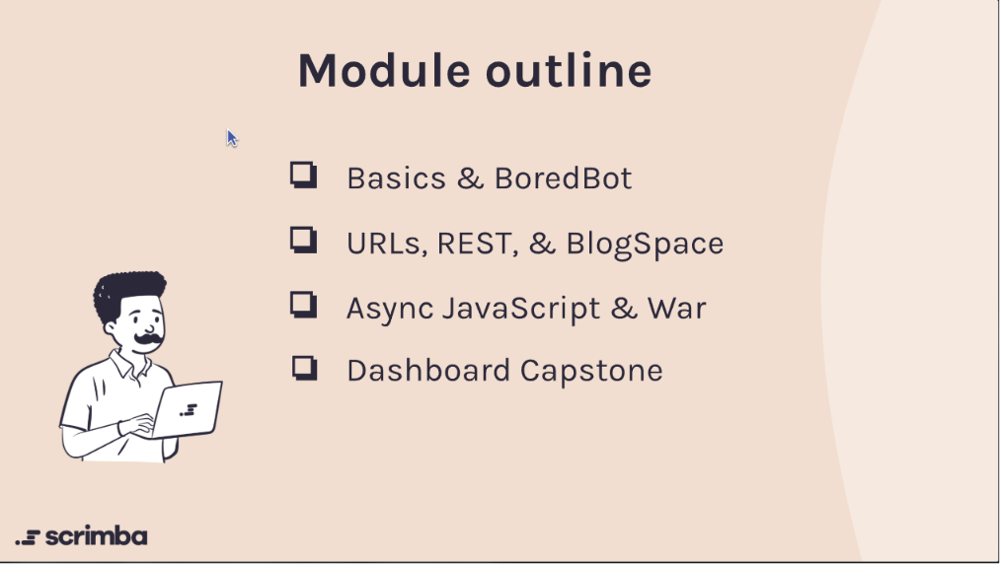

### 2. How APIs Connect Systems

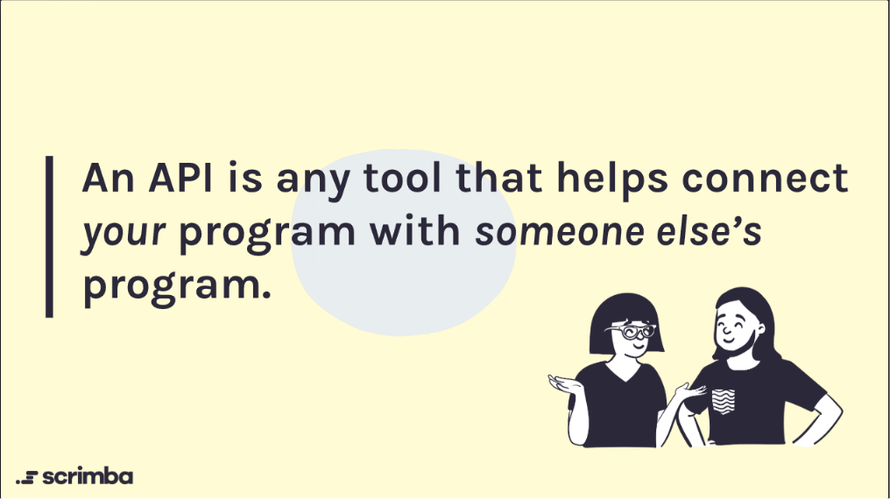

### 3. Web APIs on MDN

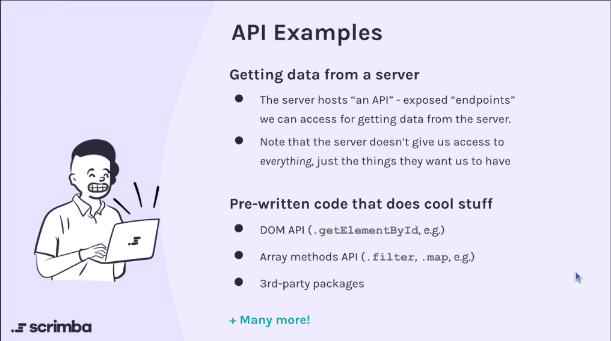

</details>

### 📝 Quiz & Recap

_(Original file: [quiz.md](file:///c:/Users/suyas/Downloads/CODING%281%29/NEXTGEN-CODE/05-07-2026/APIs%20and%20Async%20JavaScript/What%20is%20an%20API/quiz.md))_

> [!NOTE]
> **What does API stand for?**
>
> - **Answer:** **Application Programming Interface**

> [!TIP]
> **How would you describe an API in your own words?**
>
> - **Answer:** A tool or interface that allows your code to "talk" to and use the functionality or data of another program or service (e.g., Web APIs, third-party packages, etc.).

> [!IMPORTANT]
> **What are some examples of APIs you have used?**
>
> - **BoredAPI** - A web service to fetch random activity suggestions.
> - **Local Storage (localStorage)** - A built-in browser API to store data locally on the user's device.

### 🔗 Chapter 1 Resources

- 📄 **MDN Web Docs:** [MDN Web API Reference](https://developer.mozilla.org/en-US/docs/Web/API) - Learn about browser-provided Web APIs.

---

## 🖥️ Chapter 2: Clients & Servers

### Core Concept

The **Client-Server model** describes how computers interact over a network:

- **Client:** The device or application (like a web browser, phone, or laptop) that requests information or services.
- **Server:** A powerful computer or software system that stores data/services, listens for requests from clients, and responds with the requested data.

### 💡 Visualizations

<details>
  <summary><b>📷 Expand to View Clients & Servers Diagrams</b></summary>
  <br>

### 1. Clients & Servers Overview

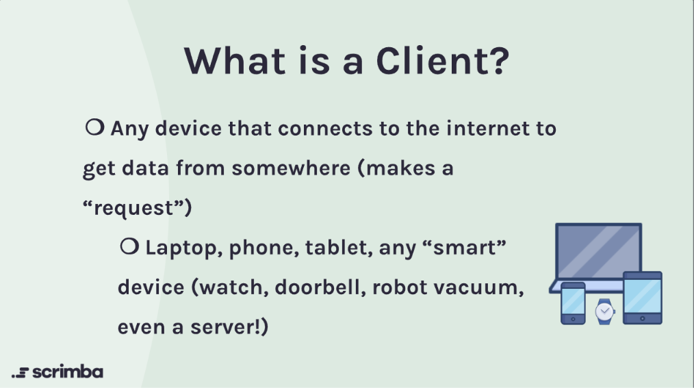

### 2. Client-Server Communication Flow

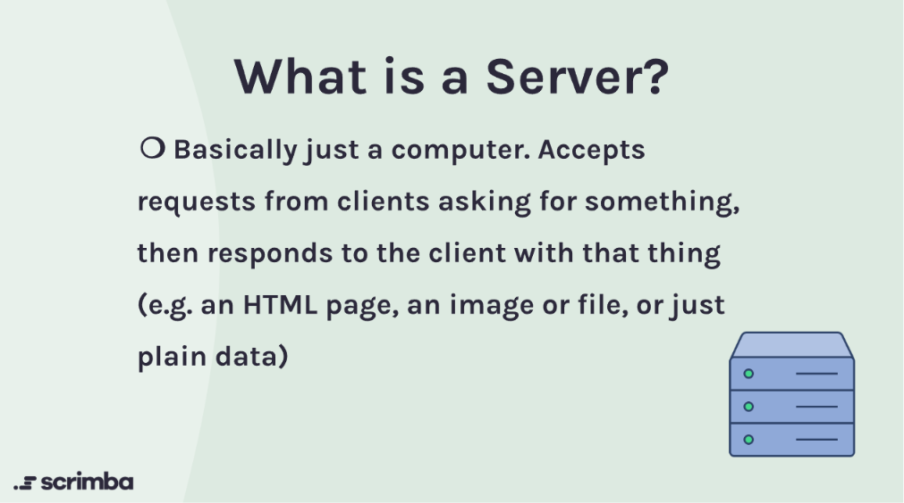

</details>

### 📝 Quiz & Recap

_(Original file: [quiz.md](file:///c:/Users/suyas/Downloads/CODING%281%29/NEXTGEN-CODE/05-07-2026/APIs%20and%20Async%20JavaScript/Clients%20&%20Servers/quiz.md))_

> [!NOTE]
> **What are some examples of "clients" you've used today?**
>
> - **Answer:** Laptop, phone, watch, smart TV, or web browser.

> [!TIP]
> **How would you explain what a "server" is to a 5-year-old?**
>
> - **Answer:** Imagine a big toy box in your friend’s house that has all the toys you like. When you visit, you ask, _"Can I have the car toy?"_ and your friend takes it from the box and gives it to you. The toy box is like the server: it keeps all the toys safe and gives the right toy when someone asks.

> [!IMPORTANT]
> **In what way do clients and servers interact with each other?**
>
> - **The Request-Response Cycle:** The client sends a **request** over the network saying what data or service it wants. The server receives the request, processes it (like searching a database or retrieving a file), and sends a **response** back.

### 🔗 Chapter 2 Resources

- 📄 **Vite Documentation:** [Vite Config Guide](https://vitejs.dev/) - How to configure build tooling for modern JS apps.
- 📄 **Scrimba Courses:** [Scrimba Course Portal](https://scrimba.com/courses) | [The Frontend Career Path](https://scrimba.com/fullstack-path-c0fullstack)

---

## 📨 Chapter 3: Requests & Responses

### Core Concept

In the web communication flow, a **Request** is initiated by the client to obtain files or data from a server, and the server returns a **Response** indicating success, redirection, client error, or server error using standardized status codes.

- **Client Requests:** A client can request code files (`index.html`, `style.css`, `script.js`) or data payloads (like a `JSON` file or API payload).
- **Server Responses:** The server's main job is to listen for requests, process them, and send back a response containing the status code and matching headers/body.

### 💡 Visualizations

<details>
  <summary><b>📷 Expand to View Requests & Responses Diagrams</b></summary>
  <br>

### 1. Requesting Files

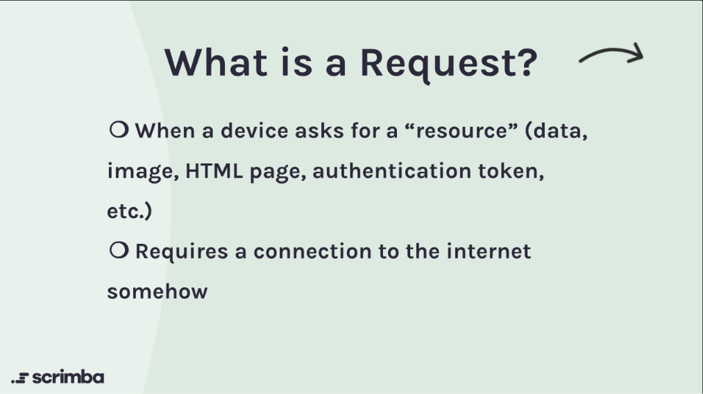

### 2. Request and Response Anatomy

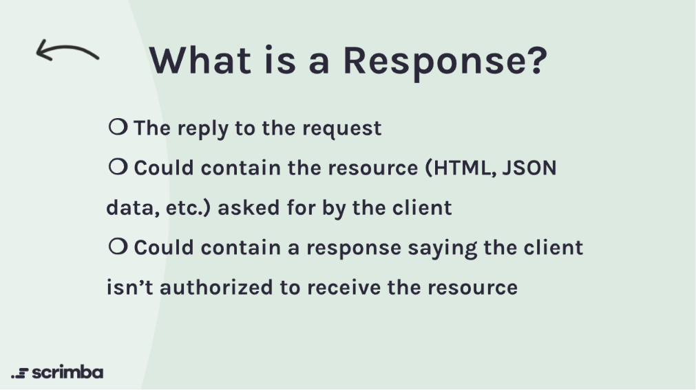

### 3. Server Response Processing

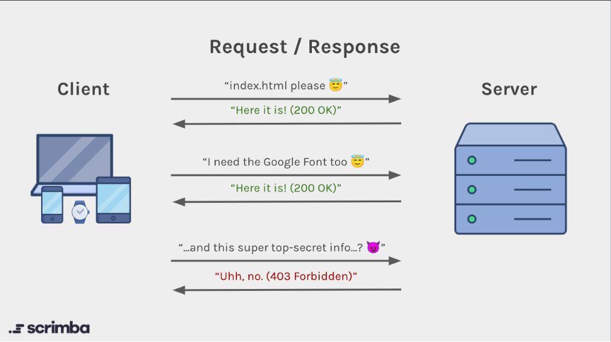

</details>

### 📝 Quiz & Recap

_(Original file: [quiz.md](file:///c:/Users/suyas/Downloads/CODING%281%29/NEXTGEN-CODE/05-07-2026/APIs%20and%20Async%20JavaScript/Requests%20&%20Responses/quiz.md))_

> [!NOTE]
> **What are 3 things your computer (client) might request from a server?**
>
> - **Answer:** `index.html`, `style.css`, `script.js`, or a `JSON` data payload.

> [!TIP]
> **What is the main job of a server?**
>
> - **Answer:** To listen to incoming requests, process them (e.g., fetch data from a database), and reply with a response. The client asks, and the server provides.

> [!IMPORTANT]
> **What are the classes of HTTP response status codes?**
>
> - **100 – 199:** Informational responses
> - **200 – 299 (Success):** E.g., `200 OK` (success), `201 Created` (resource created), `204 No Content` (success without body)
> - **300 – 399 (Redirection):** E.g., `301 Moved Permanently`, `302 Found`, `304 Not Modified` (use cache)
> - **400 – 499 (Client Errors):** E.g., `400 Bad Request` (syntax error), `401 Unauthorized`, `403 Forbidden`, `404 Not Found` (invalid URL/resource), `429 Too Many Requests` (rate limited)
> - **500 – 599 (Server Errors):** E.g., `500 Internal Server Error` (server crashed), `502 Bad Gateway`, `503 Service Unavailable` (overloaded), `504 Gateway Timeout`

### 🔗 Chapter 3 Resources

- 📄 **MDN Docs:** [HTTP Response Status Codes](https://developer.mozilla.org/en-US/docs/Web/HTTP/Status) - Details on all standard status codes.

---

## 🤖 Chapter 4: BoredBot Intro

### Core Concept

**BoredBot** (also styled as **HappyBot**) is a simple interactive web application that helps users find activities when they are bored. This project demonstrates how to make network requests to a third-party API and use the received data to dynamically update the web page.

Key technical implementation details:

- **The Fetch API:** Initiating an asynchronous request to BoredAPI: `fetch("https://www.boredapi.com/api/activity")`.
- **Promise Chaining:** Handling the response stream using `.then(res => res.json())` to parse the payload as JSON, and a subsequent `.then(data => ...)` to access the activity data.
- **DOM Modification:** Dynamically inserting `data.activity` into the page, changing text headings, and updating CSS classes on body click.

### 💻 Code Implementation

You can explore the source files for BoredBot below:

- [index.html](file:///c:/Users/suyas/Downloads/CODING%281%29/NEXTGEN-CODE/05-07-2026/APIs%20and%20Async%20JavaScript/BoredBot%20Intro/index.html) - Structural markup containing the bot trigger button and placeholder text.
- [index.js](file:///c:/Users/suyas/Downloads/CODING%281%29/NEXTGEN-CODE/05-07-2026/APIs%20and%20Async%20JavaScript/BoredBot%20Intro/index.js) - JavaScript logic handling event listeners, API fetch promises, and DOM updates.
- [index.css](file:///c:/Users/suyas/Downloads/CODING%281%29/NEXTGEN-CODE/05-07-2026/APIs%20and%20Async%20JavaScript/BoredBot%20Intro/index.css) - Styling sheet containing the visual themes (including the `.fun` body class theme).

```javascript
// BoredBot index.js snippet
document.getElementById("bored-bot").addEventListener("click", getIdea);

function getIdea() {
  fetch("https://www.boredapi.com/api/activity")
    .then((res) => res.json())
    .then((data) => {
      document.body.classList.add("fun");
      document.getElementById("idea").textContent = data.activity;
      document.getElementById("title").textContent = "🦾 HappyBot🦿";
    });
}
```

### 🔗 Chapter 4 Resources

- 📄 **MDN Web Docs:** [Using the Fetch API](https://developer.mozilla.org/en-US/docs/Web/API/Fetch_API/Using_Fetch) - Overview and guides on using `fetch()`.
- 📄 **API Endpoint:** [BoredAPI Activity Endpoint](https://www.boredapi.com/api/activity)

---

## 📄 Chapter 5: JSON Review

### Core Concept

**JSON (JavaScript Object Notation)** is a lightweight text-based data-interchange format that is language-independent. It is widely used to transmit data in web applications (e.g., sending data from a server to a client so it can be parsed and rendered).

Key syntax rules of JSON compared to standard JS Objects:

- **Double Quotes Required:** All property names (keys) and string values must be enclosed in double quotes (e.g., `"name": "Sarah"`). Single quotes are invalid.
- **No Trailing Commas:** The last element in an array or object must not end with a trailing comma.
- **Supported Data Types:** Strings, Numbers, JSON Objects, Arrays, Booleans (`true`/`false`), and `null`. (Functions, dates, and `undefined` are not supported).
- **No Comments:** JSON files do not support code comments.

### 💡 Visualizations

<details>
  <summary><b>📷 Expand to View JSON Concepts & Validation Diagrams</b></summary>
  <br>

### 1. JSON Format & Structure

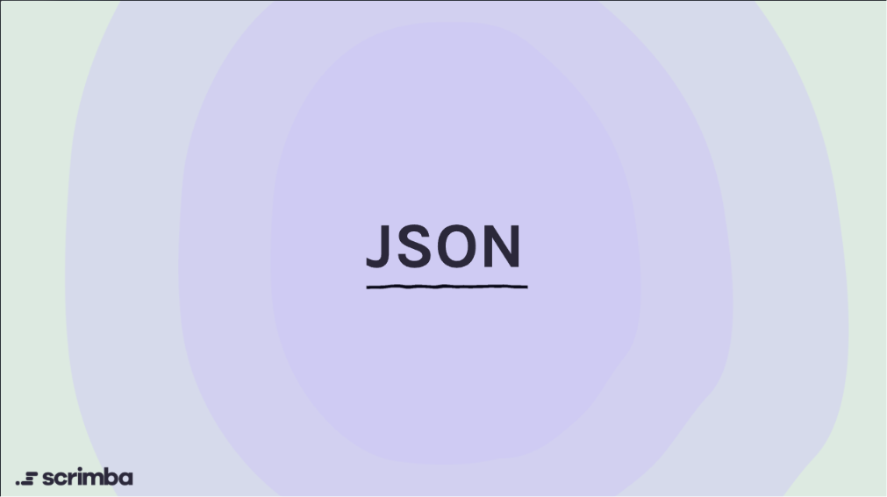

### 2. JSON Syntax Rules

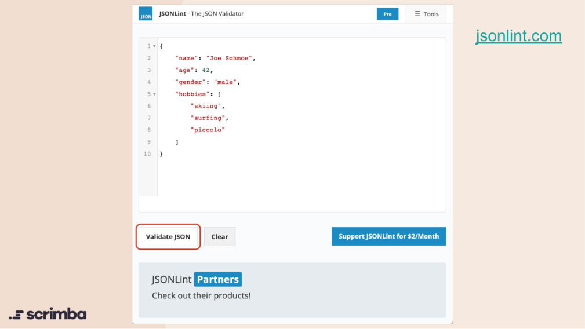

### 3. Validating JSON Data

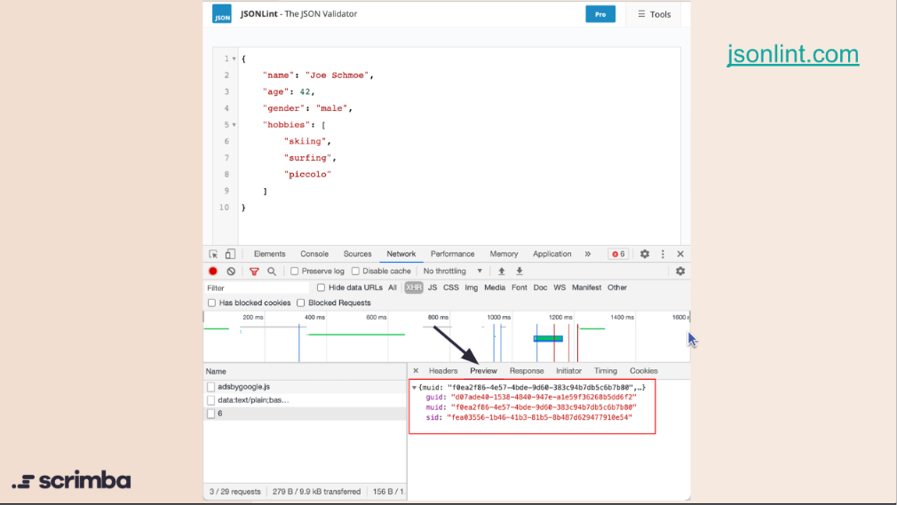

</details>

### 💻 Code Examples

You can review the sample JSON files below:

- [person.json](file:///c:/Users/suyas/Downloads/CODING%281%29/NEXTGEN-CODE/05-07-2026/APIs%20and%20Async%20JavaScript/JSON%20Review/person.json) - Simple single object representation.
- [people.json](file:///c:/Users/suyas/Downloads/CODING%281%29/NEXTGEN-CODE/05-07-2026/APIs%20and%20Async%20JavaScript/JSON%20Review/people.json) - Array containing multiple JSON objects.

### 🔗 Chapter 5 Resources

- 🛠️ **JSON Validator:** [JSONLint](https://jsonlint.com/) - The free online validator and reformatting tool for JSON.
- 📄 **MDN Web Docs:** [Working with JSON](https://developer.mozilla.org/en-US/docs/Learn/JavaScript/Objects/JSON) - Guide to parsing, generating, and manipulating JSON in JS.

---

## 🐶 Chapter 6: First Fetch

### Core Concept

In this chapter, we write our very first `fetch()` request from scratch to retrieve data from a public API.

Key technical steps:

- **Fetching Data:** We initiate a request to the Dog API endpoint: `fetch("https://dog.ceo/api/breeds/image/random")`.
- **Parsing the Response:** Since the response comes back as a stream, we parse it into a JavaScript object using `.then(response => response.json())`.
- **Handling the Data:** Finally, we chain another `.then(data => console.log(data))` to access the actual JSON payload and print it to the console.

### 💡 Visualizations

<details>
  <summary><b>📷 Expand to View Fetch & Promises Diagrams</b></summary>
  <br>

### 1. Understanding Fetch

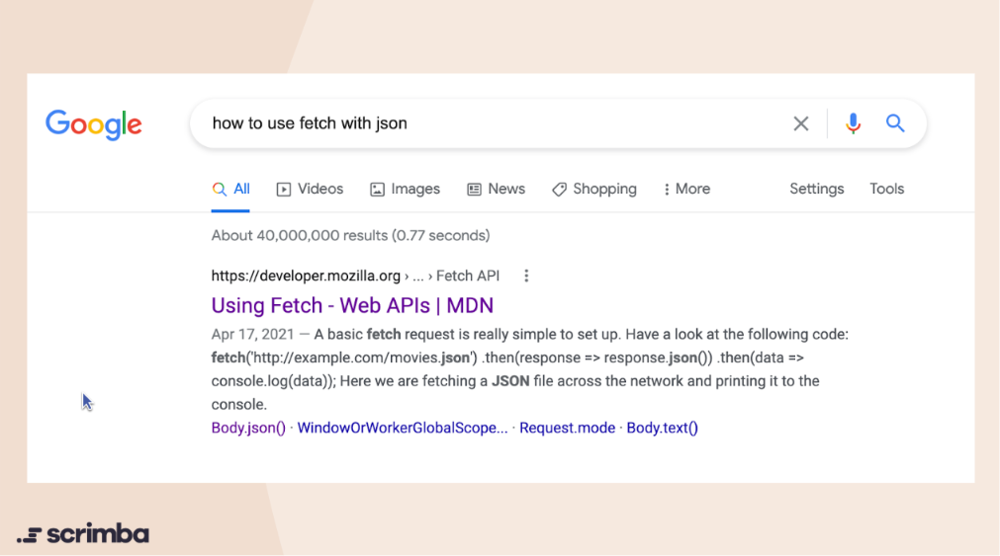

### 2. Fetch Response & JSON

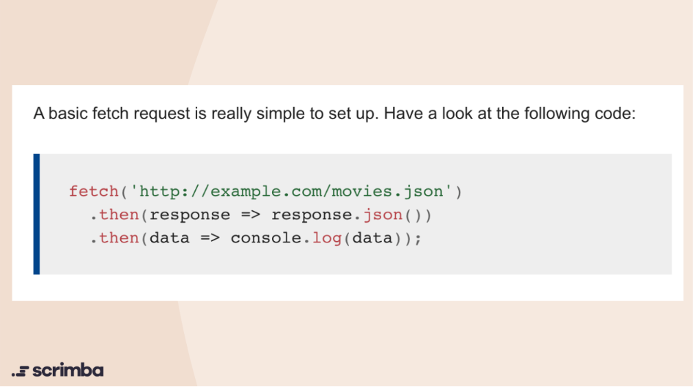

</details>

### 💻 Code Implementation

You can explore the source files for this practice below:

- [index.html](file:///c:/Users/suyas/Downloads/CODING%281%29/NEXTGEN-CODE/05-07-2026/APIs%20and%20Async%20JavaScript/First%20fetch/index.html) - Basic markup structure.
- [index.js](file:///c:/Users/suyas/Downloads/CODING%281%29/NEXTGEN-CODE/05-07-2026/APIs%20and%20Async%20JavaScript/First%20fetch/index.js) - The JavaScript file containing the fetch request logic.

```javascript
// First Fetch snippet
fetch("https://dog.ceo/api/breeds/image/random")
  .then((response) => response.json())
  .then((data) => console.log(data));
```

### 🔗 Chapter 6 Resources

- 📄 **API Endpoint:** [Dog API Random Image](https://dog.ceo/api/breeds/image/random)

---

## ⏱️ Chapter 7: `.then()` & Asynchronous JavaScript

### Core Concept

In this chapter, we explore how **Asynchronous JavaScript** works in practice.

When we use `fetch()`, JavaScript doesn't stop and wait for the API response. Instead, it moves on to execute the rest of the synchronous code (like `console.log()` statements and `for` loops). It handles the API response asynchronously once the data actually arrives via the `.then()` method. This non-blocking behavior is what keeps web applications fast and responsive.

### 💻 Code Implementation

You can explore the source files for this practice below:

- [index.html](file:///c:/Users/suyas/Downloads/CODING%281%29/NEXTGEN-CODE/05-07-2026/APIs%20and%20Async%20JavaScript/.thenO%20and%20Asynchronous%20JavaScript/index.html) - Basic markup structure.
- [index.js](file:///c:/Users/suyas/Downloads/CODING%281%29/NEXTGEN-CODE/05-07-2026/APIs%20and%20Async%20JavaScript/.thenO%20and%20Asynchronous%20JavaScript/index.js) - JavaScript file demonstrating the non-blocking, asynchronous behavior of `fetch` compared to standard synchronous code like `console.log()` and `for` loops.

```javascript
// Asynchronous behavior demonstration
console.log("The first console log");

fetch("https://dog.ceo/api/breeds/image/random")
  .then((response) => response.json())
  .then((data) => console.log(data));

console.log("The second console log");

for (let i = 0; i < 100; i++) {
  console.log("I'm inside the for loop");
}
```

---

## 🐕 Chapter 8: Dog API Fetch and DOM Practice

### Core Concept

In this chapter, we combine the Fetch API with DOM manipulation. We make an API request to retrieve a random dog image URL and dynamically insert it into the webpage.

Key technical steps:

- **Fetching Data:** Requesting data from the Dog API.
- **Accessing the DOM:** Targeting an element (like a `<div>`) using `document.getElementById()`.
- **Updating HTML:** Using `.innerHTML` to insert an `` tag where the `src` attribute is dynamically set using template literals containing the fetched image URL (`${data.message}`).

### 💻 Code Implementation

You can explore the source files for this practice below:

- [index.html](file:///c:/Users/suyas/Downloads/CODING%281%29/NEXTGEN-CODE/05-07-2026/APIs%20and%20Async%20JavaScript/Dog%20API%20Fetch%20and%20DOM%20Practice/index.html) - Markup containing the empty `#image-container` div.
- [index.js](file:///c:/Users/suyas/Downloads/CODING%281%29/NEXTGEN-CODE/05-07-2026/APIs%20and%20Async%20JavaScript/Dog%20API%20Fetch%20and%20DOM%20Practice/index.js) - JavaScript logic fetching the image and appending it to the DOM.

```javascript
// Fetch and DOM Manipulation
fetch("https://dog.ceo/api/breeds/image/random")
  .then((response) => response.json())
  .then((data) => {
    console.log(data);
    document.getElementById("image-container").innerHTML = `
            
        `;
  });
```

### 🔗 Chapter 8 Resources

- 📄 **API Endpoint:** [Dog API Random Image](https://dog.ceo/api/breeds/image/random)

---

## 💡 Chapter 9: Fetch idea from Bored API

### Core Concept

In this chapter, we reinforce our knowledge of the Fetch API by connecting to the Bored API (via Scrimba's proxy). We request a random activity and update the text content of a DOM element to display the fetched idea.

Key technical steps:

- **Fetching Data:** Requesting data from the Bored API (`https://apis.scrimba.com/bored/api/activity`).
- **Handling JSON:** Converting the response stream into JSON format.
- **Updating Text Content:** Extracting the `activity` property from the returned JSON object and setting it as the `.textContent` of our `#activity-name` element in the DOM.

### 💻 Code Implementation

You can explore the source files for this practice below:

- [index.html](file:///c:/Users/suyas/Downloads/CODING%281%29/NEXTGEN-CODE/05-07-2026/APIs%20and%20Async%20JavaScript/Fetch%20idea%20from%20Bored%20API/index.html) - Markup containing the empty `#activity-name` heading.
- [index.js](file:///c:/Users/suyas/Downloads/CODING%281%29/NEXTGEN-CODE/05-07-2026/APIs%20and%20Async%20JavaScript/Fetch%20idea%20from%20Bored%20API/index.js) - JavaScript logic fetching the activity and injecting the text into the DOM.

```javascript
// Fetch activity from Bored API
fetch("https://apis.scrimba.com/bored/api/activity")
  .then((response) => response.json())
  .then((data) => {
    console.log(data);
    document.getElementById("activity-name").textContent = data.activity;
  });
```

### 🔗 Chapter 9 Resources

- 📄 **API Endpoint:** [Bored API (Scrimba Proxy)](https://apis.scrimba.com/bored/api/activity)

---

## 🤖 Chapter 10: BoredBot - HTML

### Core Concept

In this chapter, we begin building out the skeleton for our BoredBot application by writing the initial HTML structure.

Key technical steps:

- **App Title:** Setting up a descriptive `<h1>` title ("BoredBot").
- **Placeholder:** Providing a `<h4>` element that will later be populated dynamically with a random idea from the API.
- **Button Setup:** Adding an empty `<button>` element that will be used to trigger the API request.

### 💻 Code Implementation

You can explore the source files for this practice below:

- [index.html](file:///c:/Users/suyas/Downloads/CODING%281%29/NEXTGEN-CODE/05-07-2026/APIs%20and%20Async%20JavaScript/BoredBot%20-%20HTML/index.html) - The HTML skeleton containing the title, placeholder, and button.
- [index.js](file:///c:/Users/suyas/Downloads/CODING%281%29/NEXTGEN-CODE/05-07-2026/APIs%20and%20Async%20JavaScript/BoredBot%20-%20HTML/index.js) - The JavaScript file (currently mostly containing comments and commented-out fetch logic).

```html
<!-- HTML Skeleton Snippet -->
<body>
  <h1>🤖 BoredBot 🤖</h1>
  <h4>Find something to do</h4>
  <button></button>
  <script src="index.js"></script>
</body>
```

---

## 🎨 Chapter 11: BoredBot - CSS

### Core Concept

In this chapter, we style the HTML skeleton of our BoredBot application using CSS. The styling is focused on making the UI clean, modern, and engaging.

Key styling implementations:

- **Flexbox Layout:** Using `display: flex` on the `body` to center the application perfectly on the screen.
- **Container Styling:** Adding a white background, rounded corners (`border-radius`), padding, and a subtle box shadow (`box-shadow`) to create a card-like interface.
- **Interactive Button:** Styling the primary call-to-action button with a circular shape, bright colors, drop shadow, and smooth transitions for a nice hover effect (`transform: translateY(-2px)`).

### 💻 Code Implementation

You can explore the source files for this practice below:

- [index.html](file:///c:/Users/suyas/Downloads/CODING%281%29/NEXTGEN-CODE/05-07-2026/APIs%20and%20Async%20JavaScript/BoredBot%20-%20CSS/index.html) - The HTML structure.
- [index.css](file:///c:/Users/suyas/Downloads/CODING%281%29/NEXTGEN-CODE/05-07-2026/APIs%20and%20Async%20JavaScript/BoredBot%20-%20CSS/index.css) - The CSS stylesheet that brings the app to life.

```css
/* Button Styling Snippet */
#get-activity-btn {
  border: none;
  background-color: #4f46e5;
  color: #ffffff;
  width: 64px;
  height: 64px;
  border-radius: 50%;
  font-size: 1.5rem;
  cursor: pointer;
  box-shadow: 0 6px 18px rgba(79, 70, 229, 0.35);
  transition:
    transform 0.15s ease,
    box-shadow 0.15s ease;
}

#get-activity-btn:hover {
  transform: translateY(-2px);
  box-shadow: 0 10px 24px rgba(79, 70, 229, 0.45);
}
```

---

## 🚀 Chapter 12: BoredBot - JavaScript

### Core Concept

In this chapter, we wire up the functionality of our BoredBot application using JavaScript. We listen for button clicks to trigger our asynchronous API request and then dynamically update the DOM with the received data.

Key technical steps:

- **Event Listeners:** Attaching an `addEventListener("click", ...)` to the main button so the bot only acts when requested.
- **Fetching Data on Click:** Triggering the `fetch()` request to the Bored API inside the event listener callback function.
- **Updating the UI:** Waiting for the response to resolve into JSON, extracting the `activity` string, and updating the text content of our placeholder element (`#activityBtn`).

### 💻 Code Implementation

You can explore the source files for this practice below:

- [index.html](file:///c:/Users/suyas/Downloads/CODING%281%29/NEXTGEN-CODE/05-07-2026/APIs%20and%20Async%20JavaScript/BoredBot%20-%20JavaScript/index.html) - The HTML structure.
- [index.js](file:///c:/Users/suyas/Downloads/CODING%281%29/NEXTGEN-CODE/05-07-2026/APIs%20and%20Async%20JavaScript/BoredBot%20-%20JavaScript/index.js) - The JavaScript logic bringing interactivity to the application.

```javascript
// BoredBot JavaScript Interactivity Snippet
const activityButtton = document.getElementById("boredBtn");

activityButtton.addEventListener("click", function () {
  console.log("Button Clicked");
  fetch("https://apis.scrimba.com/bored/api/activity")
    .then((response) => response.json())
    .then((data) => {
      console.log(data);
      document.getElementById("activityBtn").textContent = data.activity;
    });
});
```

---

## 🎨 Chapter 13: BoredBot - Extra Styling

### Core Concept

In this chapter, we dynamically update the UI styling and content via JavaScript immediately after fetching the data from the Bored API.

Key technical steps:

- **Dynamic Text Updates:** Modifying the `textContent` of the title element (`#title`) to dynamically change it to "🦾 HappyBot🦿" once data is received.
- **Dynamic CSS Classes:** Manipulating the `classList` property of `document.body` to add a new class (`.fun`) that triggers a CSS state change (e.g., updating the background gradient and colors).

### 💻 Code Implementation

You can explore the source files for this practice below:

- [index.html](file:///c:/Users/suyas/Downloads/CODING%281%29/NEXTGEN-CODE/05-07-2026/APIs%20and%20Async%20JavaScript/BoredBot%20-%20Extra%20Styling/index.html) - The HTML structure.
- [index.css](file:///c:/Users/suyas/Downloads/CODING%281%29/NEXTGEN-CODE/05-07-2026/APIs%20and%20Async%20JavaScript/BoredBot%20-%20Extra%20Styling/index.css) - The CSS stylesheet including the `.fun` body class for dynamic background styling.
- [index.js](file:///c:/Users/suyas/Downloads/CODING%281%29/NEXTGEN-CODE/05-07-2026/APIs%20and%20Async%20JavaScript/BoredBot%20-%20Extra%20Styling/index.js) - The JavaScript logic managing event listeners and DOM class manipulation.

```javascript
// BoredBot Dynamic Styling Snippet
document.getElementById("get-activity").addEventListener("click", function () {
  fetch("https://apis.scrimba.com/bored/api/activity")
    .then((response) => response.json())
    .then((data) => {
      document.getElementById("activity").textContent = data.activity;
      document.getElementById("title").textContent = "🦾 HappyBot🦿";
      document.body.classList.add("fun");
    });
});
```
