# 🌐 APIs & Asynchronous JavaScript

APIs (Application Programming Interfaces) and the Client-Server model are the backbone of the modern web. They allow developers to connect different services, fetch dynamic data, and build interactive applications. By leveraging **Asynchronous JavaScript**, we can fetch data, handle background tasks, and keep the user interface smooth and responsive.

---

## 📖 Chapter 1: What is an API?

### Core Concept

An **API (Application Programming Interface)** is a software intermediary that allows two applications to talk to each other. It allows your code to communicate with and leverage the features/data of someone else's code or service.

- **Browser/Web APIs:** Built-in tools provided directly by the web browser (e.g., `localStorage`, `fetch()`, Geolocation, DOM Manipulation).
- **Third-Party APIs:** External services run by other providers that you access over the web (e.g., BoredAPI, OpenWeatherMap, GitHub API).

### 💡 Visualizations

<details>
  <summary><b>📷 Expand to View API Visualizations & Slides</b></summary>
  <br>

### 1. What is an API?

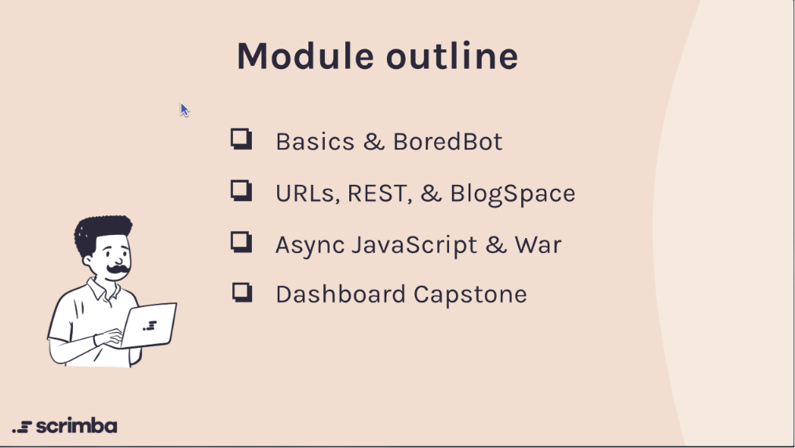

### 2. How APIs Connect Systems

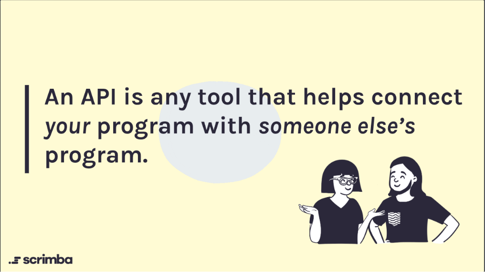

### 3. Web APIs on MDN

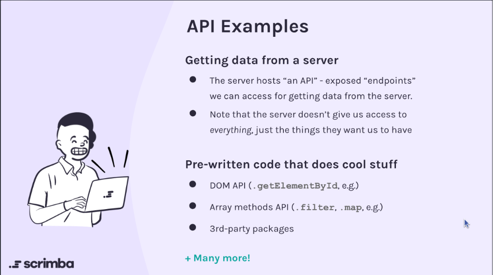

</details>

### 📝 Quiz & Recap

_(Original file: [quiz.md](<file:///c:/Users/suyas/Downloads/CODING%281%29/NEXTGEN-CODE/05-07-2026/APIs%20and%20Async%20JavaScript/Intro%20to%20APIs/What%20is%20an%20API/quiz.md>))_

> [!NOTE]
> **What does API stand for?**
>
> - **Answer:** **Application Programming Interface**

> [!TIP]
> **How would you describe an API in your own words?**
>
> - **Answer:** A tool or interface that allows your code to "talk" to and use the functionality or data of another program or service (e.g., Web APIs, third-party packages, etc.).

> [!IMPORTANT]
> **What are some examples of APIs you have used?**
>
> - **BoredAPI** - A web service to fetch random activity suggestions.
> - **Local Storage (localStorage)** - A built-in browser API to store data locally on the user's device.

### 🔗 Chapter 1 Resources

- 📄 **MDN Web Docs:** [MDN Web API Reference](https://developer.mozilla.org/en-US/docs/Web/API) - Learn about browser-provided Web APIs.

---

## 🖥️ Chapter 2: Clients & Servers

### Core Concept

The **Client-Server model** describes how computers interact over a network:

- **Client:** The device or application (like a web browser, phone, or laptop) that requests information or services.
- **Server:** A powerful computer or software system that stores data/services, listens for requests from clients, and responds with the requested data.

### 💡 Visualizations

<details>
  <summary><b>📷 Expand to View Clients & Servers Diagrams</b></summary>
  <br>

### 1. Clients & Servers Overview

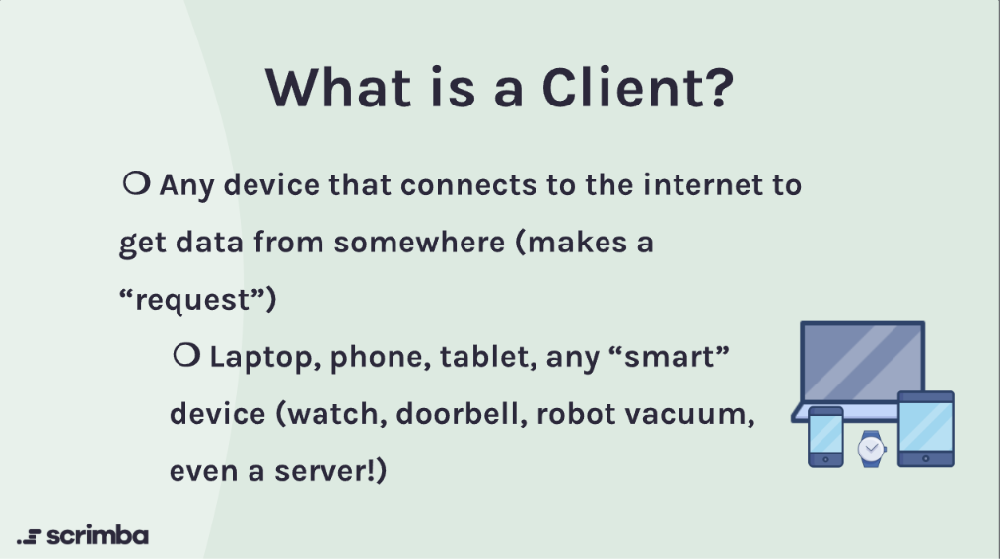

### 2. Client-Server Communication Flow

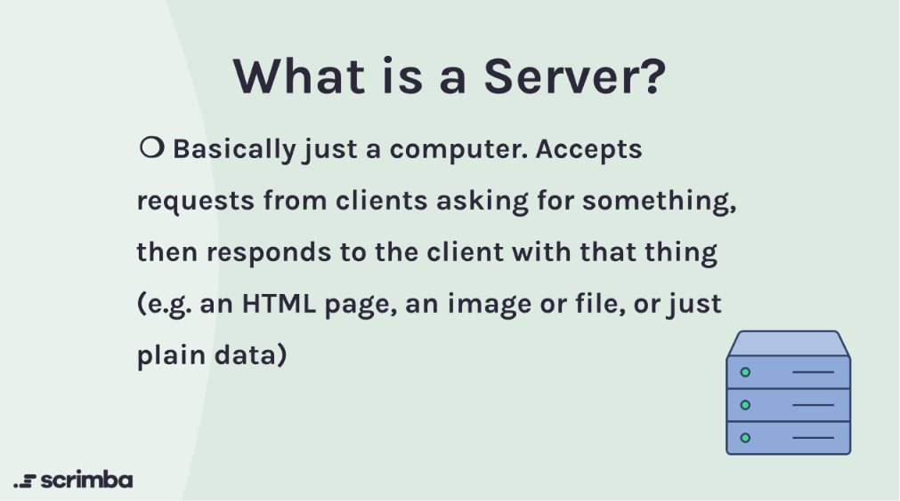

</details>

### 📝 Quiz & Recap

_(Original file: [quiz.md](<file:///c:/Users/suyas/Downloads/CODING%281%29/NEXTGEN-CODE/05-07-2026/APIs%20and%20Async%20JavaScript/Intro%20to%20APIs/Clients%20&%20Servers/quiz.md>))_

> [!NOTE]
> **What are some examples of "clients" you've used today?**
>
> - **Answer:** Laptop, phone, watch, smart TV, or web browser.

> [!TIP]
> **How would you explain what a "server" is to a 5-year-old?**
>
> - **Answer:** Imagine a big toy box in your friend’s house that has all the toys you like. When you visit, you ask, _"Can I have the car toy?"_ and your friend takes it from the box and gives it to you. The toy box is like the server: it keeps all the toys safe and gives the right toy when someone asks.

> [!IMPORTANT]
> **In what way do clients and servers interact with each other?**
>
> - **The Request-Response Cycle:** The client sends a **request** over the network saying what data or service it wants. The server receives the request, processes it (like searching a database or retrieving a file), and sends a **response** back.

### 🔗 Chapter 2 Resources

- 📄 **Vite Documentation:** [Vite Config Guide](https://vitejs.dev/) - How to configure build tooling for modern JS apps.
- 📄 **Scrimba Courses:** [Scrimba Course Portal](https://scrimba.com/courses) | [The Frontend Career Path](https://scrimba.com/fullstack-path-c0fullstack)

---

## 📨 Chapter 3: Requests & Responses

### Core Concept

In the web communication flow, a **Request** is initiated by the client to obtain files or data from a server, and the server returns a **Response** indicating success, redirection, client error, or server error using standardized status codes.

- **Client Requests:** A client can request code files (`index.html`, `style.css`, `script.js`) or data payloads (like a `JSON` file or API payload).
- **Server Responses:** The server's main job is to listen for requests, process them, and send back a response containing the status code and matching headers/body.

### 💡 Visualizations

<details>
  <summary><b>📷 Expand to View Requests & Responses Diagrams</b></summary>
  <br>

### 1. Requesting Files

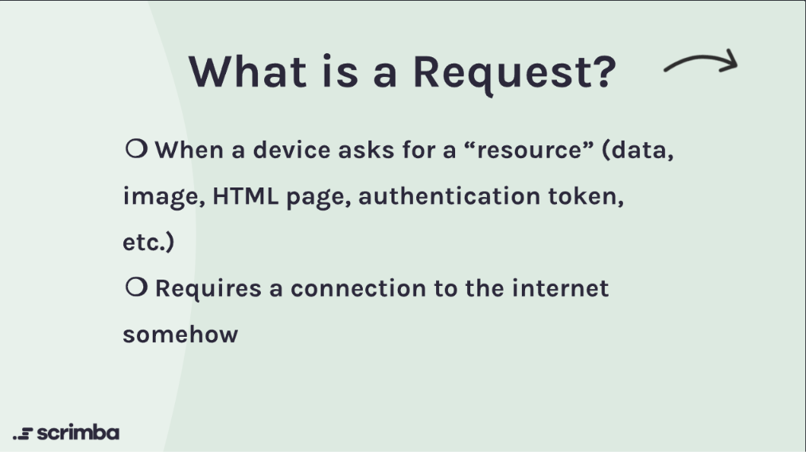

### 2. Request and Response Anatomy

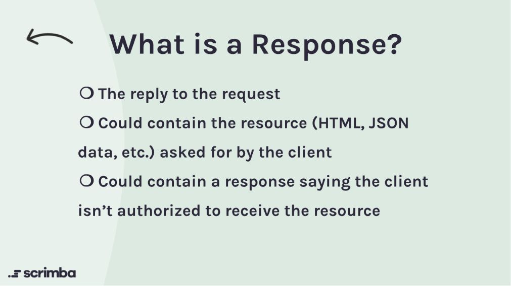

### 3. Server Response Processing

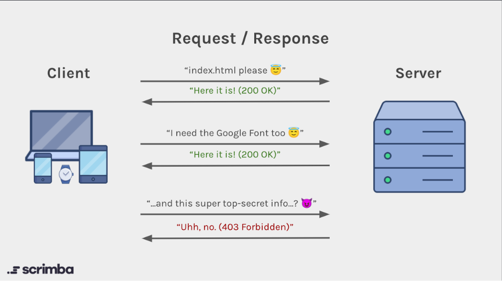

</details>

### 📝 Quiz & Recap

_(Original file: [quiz.md](<file:///c:/Users/suyas/Downloads/CODING%281%29/NEXTGEN-CODE/05-07-2026/APIs%20and%20Async%20JavaScript/Intro%20to%20APIs/Requests%20&%20Responses/quiz.md>))_

> [!NOTE]
> **What are 3 things your computer (client) might request from a server?**
>
> - **Answer:** `index.html`, `style.css`, `script.js`, or a `JSON` data payload.

> [!TIP]
> **What is the main job of a server?**
>
> - **Answer:** To listen to incoming requests, process them (e.g., fetch data from a database), and reply with a response. The client asks, and the server provides.

> [!IMPORTANT]
> **What are the classes of HTTP response status codes?**
>
> - **100 – 199:** Informational responses
> - **200 – 299 (Success):** E.g., `200 OK` (success), `201 Created` (resource created), `204 No Content` (success without body)
> - **300 – 399 (Redirection):** E.g., `301 Moved Permanently`, `302 Found`, `304 Not Modified` (use cache)
> - **400 – 499 (Client Errors):** E.g., `400 Bad Request` (syntax error), `401 Unauthorized`, `403 Forbidden`, `404 Not Found` (invalid URL/resource), `429 Too Many Requests` (rate limited)
> - **500 – 599 (Server Errors):** E.g., `500 Internal Server Error` (server crashed), `502 Bad Gateway`, `503 Service Unavailable` (overloaded), `504 Gateway Timeout`

### 🔗 Chapter 3 Resources

- 📄 **MDN Docs:** [HTTP Response Status Codes](https://developer.mozilla.org/en-US/docs/Web/HTTP/Status) - Details on all standard status codes.

---

## 🤖 Chapter 4: BoredBot Intro

### Core Concept

**BoredBot** (also styled as **HappyBot**) is a simple interactive web application that helps users find activities when they are bored. This project demonstrates how to make network requests to a third-party API and use the received data to dynamically update the web page.

Key technical implementation details:

- **The Fetch API:** Initiating an asynchronous request to BoredAPI: `fetch("https://www.boredapi.com/api/activity")`.
- **Promise Chaining:** Handling the response stream using `.then(res => res.json())` to parse the payload as JSON, and a subsequent `.then(data => ...)` to access the activity data.
- **DOM Modification:** Dynamically inserting `data.activity` into the page, changing text headings, and updating CSS classes on body click.

### 💻 Code Implementation

You can explore the source files for BoredBot below:

- [index.html](<file:///c:/Users/suyas/Downloads/CODING%281%29/NEXTGEN-CODE/05-07-2026/APIs%20and%20Async%20JavaScript/Intro%20to%20APIs/BoredBot%20Intro/index.html>) - Structural markup containing the bot trigger button and placeholder text.
- [index.js](<file:///c:/Users/suyas/Downloads/CODING%281%29/NEXTGEN-CODE/05-07-2026/APIs%20and%20Async%20JavaScript/Intro%20to%20APIs/BoredBot%20Intro/index.js>) - JavaScript logic handling event listeners, API fetch promises, and DOM updates.
- [index.css](<file:///c:/Users/suyas/Downloads/CODING%281%29/NEXTGEN-CODE/05-07-2026/APIs%20and%20Async%20JavaScript/Intro%20to%20APIs/BoredBot%20Intro/index.css>) - Styling sheet containing the visual themes (including the `.fun` body class theme).

```javascript
// BoredBot index.js snippet
document.getElementById("bored-bot").addEventListener("click", getIdea);

function getIdea() {
  fetch("https://www.boredapi.com/api/activity")
    .then((res) => res.json())
    .then((data) => {
      document.body.classList.add("fun");
      document.getElementById("idea").textContent = data.activity;
      document.getElementById("title").textContent = "🦾 HappyBot🦿";
    });
}
```

### 🔗 Chapter 4 Resources

- 📄 **MDN Web Docs:** [Using the Fetch API](https://developer.mozilla.org/en-US/docs/Web/API/Fetch_API/Using_Fetch) - Overview and guides on using `fetch()`.
- 📄 **API Endpoint:** [BoredAPI Activity Endpoint](https://www.boredapi.com/api/activity)

---

## 📄 Chapter 5: JSON Review

### Core Concept

**JSON (JavaScript Object Notation)** is a lightweight text-based data-interchange format that is language-independent. It is widely used to transmit data in web applications (e.g., sending data from a server to a client so it can be parsed and rendered).

Key syntax rules of JSON compared to standard JS Objects:

- **Double Quotes Required:** All property names (keys) and string values must be enclosed in double quotes (e.g., `"name": "Sarah"`). Single quotes are invalid.
- **No Trailing Commas:** The last element in an array or object must not end with a trailing comma.
- **Supported Data Types:** Strings, Numbers, JSON Objects, Arrays, Booleans (`true`/`false`), and `null`. (Functions, dates, and `undefined` are not supported).
- **No Comments:** JSON files do not support code comments.

### 💡 Visualizations

<details>
  <summary><b>📷 Expand to View JSON Concepts & Validation Diagrams</b></summary>
  <br>

### 1. JSON Format & Structure

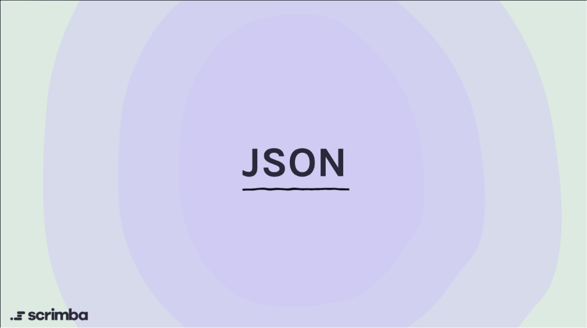

### 2. JSON Syntax Rules

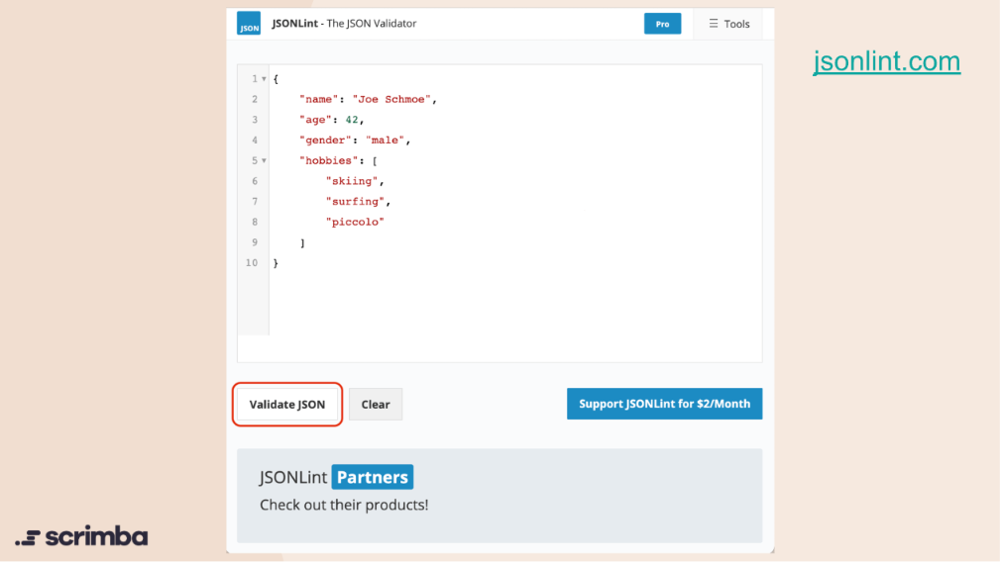

### 3. Validating JSON Data

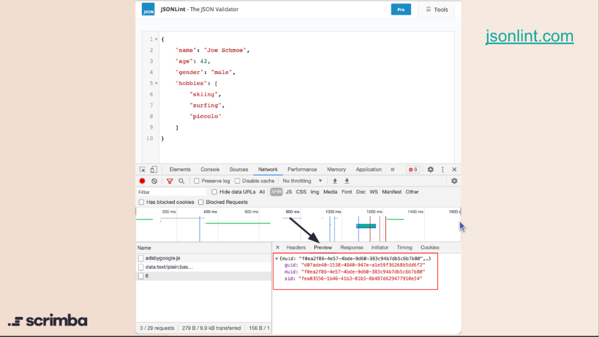

</details>

### 💻 Code Examples

You can review the sample JSON files below:

- [person.json](<file:///c:/Users/suyas/Downloads/CODING%281%29/NEXTGEN-CODE/05-07-2026/APIs%20and%20Async%20JavaScript/Intro%20to%20APIs/JSON%20Review/person.json>) - Simple single object representation.
- [people.json](<file:///c:/Users/suyas/Downloads/CODING%281%29/NEXTGEN-CODE/05-07-2026/APIs%20and%20Async%20JavaScript/Intro%20to%20APIs/JSON%20Review/people.json>) - Array containing multiple JSON objects.

### 🔗 Chapter 5 Resources

- 🛠️ **JSON Validator:** [JSONLint](https://jsonlint.com/) - The free online validator and reformatting tool for JSON.
- 📄 **MDN Web Docs:** [Working with JSON](https://developer.mozilla.org/en-US/docs/Learn/JavaScript/Objects/JSON) - Guide to parsing, generating, and manipulating JSON in JS.

---

## 🐶 Chapter 6: First Fetch

### Core Concept

In this chapter, we write our very first `fetch()` request from scratch to retrieve data from a public API.

Key technical steps:

- **Fetching Data:** We initiate a request to the Dog API endpoint: `fetch("https://dog.ceo/api/breeds/image/random")`.
- **Parsing the Response:** Since the response comes back as a stream, we parse it into a JavaScript object using `.then(response => response.json())`.
- **Handling the Data:** Finally, we chain another `.then(data => console.log(data))` to access the actual JSON payload and print it to the console.

### 💡 Visualizations

<details>
  <summary><b>📷 Expand to View Fetch & Promises Diagrams</b></summary>
  <br>

### 1. Understanding Fetch

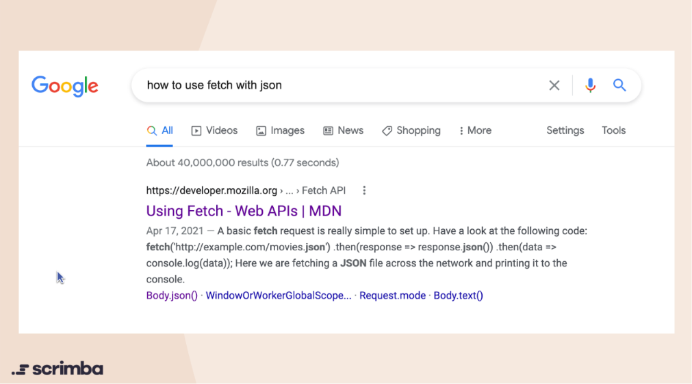

### 2. Fetch Response & JSON

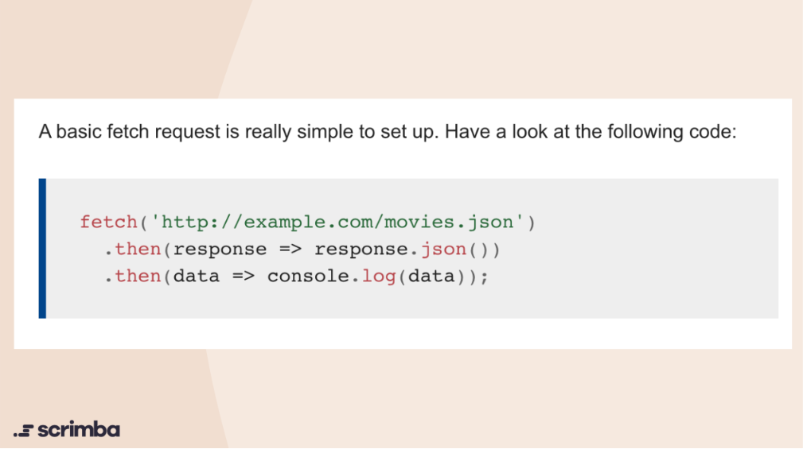

</details>

### 💻 Code Implementation

You can explore the source files for this practice below:

- [index.html](<file:///c:/Users/suyas/Downloads/CODING%281%29/NEXTGEN-CODE/05-07-2026/APIs%20and%20Async%20JavaScript/Intro%20to%20APIs/First%20fetch/index.html>) - Basic markup structure.
- [index.js](<file:///c:/Users/suyas/Downloads/CODING%281%29/NEXTGEN-CODE/05-07-2026/APIs%20and%20Async%20JavaScript/Intro%20to%20APIs/First%20fetch/index.js>) - The JavaScript file containing the fetch request logic.

```javascript
// First Fetch snippet
fetch("https://dog.ceo/api/breeds/image/random")
  .then((response) => response.json())
  .then((data) => console.log(data));
```

### 🔗 Chapter 6 Resources

- 📄 **API Endpoint:** [Dog API Random Image](https://dog.ceo/api/breeds/image/random)

---

## ⏱️ Chapter 7: `.then()` & Asynchronous JavaScript

### Core Concept

In this chapter, we explore how **Asynchronous JavaScript** works in practice.

When we use `fetch()`, JavaScript doesn't stop and wait for the API response. Instead, it moves on to execute the rest of the synchronous code (like `console.log()` statements and `for` loops). It handles the API response asynchronously once the data actually arrives via the `.then()` method. This non-blocking behavior is what keeps web applications fast and responsive.

### 💻 Code Implementation

You can explore the source files for this practice below:

- [index.html](<file:///c:/Users/suyas/Downloads/CODING%281%29/NEXTGEN-CODE/05-07-2026/APIs%20and%20Async%20JavaScript/Intro%20to%20APIs/.thenO%20and%20Asynchronous%20JavaScript/index.html>) - Basic markup structure.
- [index.js](<file:///c:/Users/suyas/Downloads/CODING%281%29/NEXTGEN-CODE/05-07-2026/APIs%20and%20Async%20JavaScript/Intro%20to%20APIs/.thenO%20and%20Asynchronous%20JavaScript/index.js>) - JavaScript file demonstrating the non-blocking, asynchronous behavior of `fetch` compared to standard synchronous code like `console.log()` and `for` loops.

```javascript
// Asynchronous behavior demonstration
console.log("The first console log");

fetch("https://dog.ceo/api/breeds/image/random")
  .then((response) => response.json())
  .then((data) => console.log(data));

console.log("The second console log");

for (let i = 0; i < 100; i++) {
  console.log("I'm inside the for loop");
}
```

---

## 🐕 Chapter 8: Dog API Fetch and DOM Practice

### Core Concept

In this chapter, we combine the Fetch API with DOM manipulation. We make an API request to retrieve a random dog image URL and dynamically insert it into the webpage.

Key technical steps:

- **Fetching Data:** Requesting data from the Dog API.
- **Accessing the DOM:** Targeting an element (like a `<div>`) using `document.getElementById()`.
- **Updating HTML:** Using `.innerHTML` to insert an `` tag where the `src` attribute is dynamically set using template literals containing the fetched image URL (`${data.message}`).

### 💻 Code Implementation

You can explore the source files for this practice below:

- [index.html](<file:///c:/Users/suyas/Downloads/CODING%281%29/NEXTGEN-CODE/05-07-2026/APIs%20and%20Async%20JavaScript/Intro%20to%20APIs/Dog%20API%20Fetch%20and%20DOM%20Practice/index.html>) - Markup containing the empty `#image-container` div.
- [index.js](<file:///c:/Users/suyas/Downloads/CODING%281%29/NEXTGEN-CODE/05-07-2026/APIs%20and%20Async%20JavaScript/Intro%20to%20APIs/Dog%20API%20Fetch%20and%20DOM%20Practice/index.js>) - JavaScript logic fetching the image and appending it to the DOM.

```javascript
// Fetch and DOM Manipulation
fetch("https://dog.ceo/api/breeds/image/random")
  .then((response) => response.json())
  .then((data) => {
    console.log(data);
    document.getElementById("image-container").innerHTML = `
            
        `;
  });
```

### 🔗 Chapter 8 Resources

- 📄 **API Endpoint:** [Dog API Random Image](https://dog.ceo/api/breeds/image/random)

---

## 💡 Chapter 9: Fetch idea from Bored API

### Core Concept

In this chapter, we reinforce our knowledge of the Fetch API by connecting to the Bored API (via Scrimba's proxy). We request a random activity and update the text content of a DOM element to display the fetched idea.

Key technical steps:

- **Fetching Data:** Requesting data from the Bored API (`https://apis.scrimba.com/bored/api/activity`).
- **Handling JSON:** Converting the response stream into JSON format.
- **Updating Text Content:** Extracting the `activity` property from the returned JSON object and setting it as the `.textContent` of our `#activity-name` element in the DOM.

### 💻 Code Implementation

You can explore the source files for this practice below:

- [index.html](<file:///c:/Users/suyas/Downloads/CODING%281%29/NEXTGEN-CODE/05-07-2026/APIs%20and%20Async%20JavaScript/Intro%20to%20APIs/Fetch%20idea%20from%20Bored%20API/index.html>) - Markup containing the empty `#activity-name` heading.
- [index.js](<file:///c:/Users/suyas/Downloads/CODING%281%29/NEXTGEN-CODE/05-07-2026/APIs%20and%20Async%20JavaScript/Intro%20to%20APIs/Fetch%20idea%20from%20Bored%20API/index.js>) - JavaScript logic fetching the activity and injecting the text into the DOM.

```javascript
// Fetch activity from Bored API
fetch("https://apis.scrimba.com/bored/api/activity")
  .then((response) => response.json())
  .then((data) => {
    console.log(data);
    document.getElementById("activity-name").textContent = data.activity;
  });
```

### 🔗 Chapter 9 Resources

- 📄 **API Endpoint:** [Bored API (Scrimba Proxy)](https://apis.scrimba.com/bored/api/activity)

---

## 🤖 Chapter 10: BoredBot - HTML

### Core Concept

In this chapter, we begin building out the skeleton for our BoredBot application by writing the initial HTML structure.

Key technical steps:

- **App Title:** Setting up a descriptive `<h1>` title ("BoredBot").
- **Placeholder:** Providing a `<h4>` element that will later be populated dynamically with a random idea from the API.
- **Button Setup:** Adding an empty `<button>` element that will be used to trigger the API request.

### 💻 Code Implementation

You can explore the source files for this practice below:

- [index.html](<file:///c:/Users/suyas/Downloads/CODING%281%29/NEXTGEN-CODE/05-07-2026/APIs%20and%20Async%20JavaScript/Intro%20to%20APIs/BoredBot%20-%20HTML/index.html>) - The HTML skeleton containing the title, placeholder, and button.
- [index.js](<file:///c:/Users/suyas/Downloads/CODING%281%29/NEXTGEN-CODE/05-07-2026/APIs%20and%20Async%20JavaScript/Intro%20to%20APIs/BoredBot%20-%20HTML/index.js>) - The JavaScript file (currently mostly containing comments and commented-out fetch logic).

```html
<!-- HTML Skeleton Snippet -->
<body>
  <h1>🤖 BoredBot 🤖</h1>
  <h4>Find something to do</h4>
  <button></button>
  <script src="index.js"></script>
</body>
```

---

## 🎨 Chapter 11: BoredBot - CSS

### Core Concept

In this chapter, we style the HTML skeleton of our BoredBot application using CSS. The styling is focused on making the UI clean, modern, and engaging.

Key styling implementations:

- **Flexbox Layout:** Using `display: flex` on the `body` to center the application perfectly on the screen.
- **Container Styling:** Adding a white background, rounded corners (`border-radius`), padding, and a subtle box shadow (`box-shadow`) to create a card-like interface.
- **Interactive Button:** Styling the primary call-to-action button with a circular shape, bright colors, drop shadow, and smooth transitions for a nice hover effect (`transform: translateY(-2px)`).

### 💻 Code Implementation

You can explore the source files for this practice below:

- [index.html](<file:///c:/Users/suyas/Downloads/CODING%281%29/NEXTGEN-CODE/05-07-2026/APIs%20and%20Async%20JavaScript/Intro%20to%20APIs/BoredBot%20-%20CSS/index.html>) - The HTML structure.
- [index.css](<file:///c:/Users/suyas/Downloads/CODING%281%29/NEXTGEN-CODE/05-07-2026/APIs%20and%20Async%20JavaScript/Intro%20to%20APIs/BoredBot%20-%20CSS/index.css>) - The CSS stylesheet that brings the app to life.

```css
/* Button Styling Snippet */
#get-activity-btn {
  border: none;
  background-color: #4f46e5;
  color: #ffffff;
  width: 64px;
  height: 64px;
  border-radius: 50%;
  font-size: 1.5rem;
  cursor: pointer;
  box-shadow: 0 6px 18px rgba(79, 70, 229, 0.35);
  transition:
    transform 0.15s ease,
    box-shadow 0.15s ease;
}

#get-activity-btn:hover {
  transform: translateY(-2px);
  box-shadow: 0 10px 24px rgba(79, 70, 229, 0.45);
}
```

---

## 🚀 Chapter 12: BoredBot - JavaScript

### Core Concept

In this chapter, we wire up the functionality of our BoredBot application using JavaScript. We listen for button clicks to trigger our asynchronous API request and then dynamically update the DOM with the received data.

Key technical steps:

- **Event Listeners:** Attaching an `addEventListener("click", ...)` to the main button so the bot only acts when requested.
- **Fetching Data on Click:** Triggering the `fetch()` request to the Bored API inside the event listener callback function.
- **Updating the UI:** Waiting for the response to resolve into JSON, extracting the `activity` string, and updating the text content of our placeholder element (`#activityBtn`).

### 💻 Code Implementation

You can explore the source files for this practice below:

- [index.html](<file:///c:/Users/suyas/Downloads/CODING%281%29/NEXTGEN-CODE/05-07-2026/APIs%20and%20Async%20JavaScript/Intro%20to%20APIs/BoredBot%20-%20JavaScript/index.html>) - The HTML structure.
- [index.js](<file:///c:/Users/suyas/Downloads/CODING%281%29/NEXTGEN-CODE/05-07-2026/APIs%20and%20Async%20JavaScript/Intro%20to%20APIs/BoredBot%20-%20JavaScript/index.js>) - The JavaScript logic bringing interactivity to the application.

```javascript
// BoredBot JavaScript Interactivity Snippet
const activityButtton = document.getElementById("boredBtn");

activityButtton.addEventListener("click", function () {
  console.log("Button Clicked");
  fetch("https://apis.scrimba.com/bored/api/activity")
    .then((response) => response.json())
    .then((data) => {
      console.log(data);
      document.getElementById("activityBtn").textContent = data.activity;
    });
});
```

---

## 🎨 Chapter 13: BoredBot - Extra Styling

### Core Concept

In this chapter, we dynamically update the UI styling and content via JavaScript immediately after fetching the data from the Bored API.

Key technical steps:

- **Dynamic Text Updates:** Modifying the `textContent` of the title element (`#title`) to dynamically change it to "🦾 HappyBot🦿" once data is received.
- **Dynamic CSS Classes:** Manipulating the `classList` property of `document.body` to add a new class (`.fun`) that triggers a CSS state change (e.g., updating the background gradient and colors).

### 💻 Code Implementation

You can explore the source files for this practice below:

- [index.html](<file:///c:/Users/suyas/Downloads/CODING%281%29/NEXTGEN-CODE/05-07-2026/APIs%20and%20Async%20JavaScript/Intro%20to%20APIs/BoredBot%20-%20Extra%20Styling/index.html>) - The HTML structure.
- [index.css](<file:///c:/Users/suyas/Downloads/CODING%281%29/NEXTGEN-CODE/05-07-2026/APIs%20and%20Async%20JavaScript/Intro%20to%20APIs/BoredBot%20-%20Extra%20Styling/index.css>) - The CSS stylesheet including the `.fun` body class for dynamic background styling.
- [index.js](<file:///c:/Users/suyas/Downloads/CODING%281%29/NEXTGEN-CODE/05-07-2026/APIs%20and%20Async%20JavaScript/Intro%20to%20APIs/BoredBot%20-%20Extra%20Styling/index.js>) - The JavaScript logic managing event listeners and DOM class manipulation.

```javascript
// BoredBot Dynamic Styling Snippet
document.getElementById("get-activity").addEventListener("click", function () {
  fetch("https://apis.scrimba.com/bored/api/activity")
    .then((response) => response.json())
    .then((data) => {
      document.getElementById("activity").textContent = data.activity;
      document.getElementById("title").textContent = "🦾 HappyBot🦿";
      document.body.classList.add("fun");
    });
});
```

---

## ♿ Chapter 14: BoredBot - Improve Accessibility (A11y)

### Core Concept

In this chapter, we focus on improving the accessibility (A11y) of our application for users relying on assistive technologies like screen readers. Semantic HTML and ARIA attributes play a crucial role in creating an inclusive experience.

Key technical steps:

- **Semantic Tags:** Wrapping the core content in a `<main>` tag to indicate the primary content of the document.
- **Appropriate Headers:** Changing the `<h4>` to a `<p>` tag because heading tags should represent document hierarchy, not visual styling.
- **ARIA Labels:** Adding `aria-label="Find a new activity."` to the empty button so screen readers know its purpose.
- **ARIA Live Regions:** Adding `aria-live="polite"` to the activity text container so screen readers automatically announce the new activity when the JavaScript updates the DOM.

### 💻 Code Implementation

You can explore the source files for this practice below:

- [index.html](<file:///c:/Users/suyas/Downloads/CODING%281%29/NEXTGEN-CODE/05-07-2026/APIs%20and%20Async%20JavaScript/Intro%20to%20APIs/BoredBot%20-%20Improve%20A1%20ly/index.html>) - The HTML structure updated with semantic elements and ARIA attributes.
- [index.js](<file:///c:/Users/suyas/Downloads/CODING%281%29/NEXTGEN-CODE/05-07-2026/APIs%20and%20Async%20JavaScript/Intro%20to%20APIs/BoredBot%20-%20Improve%20A1%20ly/index.js>) - The core application logic.

```html
<!-- Accessibility Improvements Snippet -->
<main>
  <h1 id="title">🤖 BoredBot 🤖</h1>
  <p id="activity" aria-live="polite">Find something to do</p>
  <button id="get-activity" aria-label="Find a new activity."></button>
</main>
```

<details>
  <summary><b>📷 Expand to View BoredBot Final Result</b></summary>
  <br>

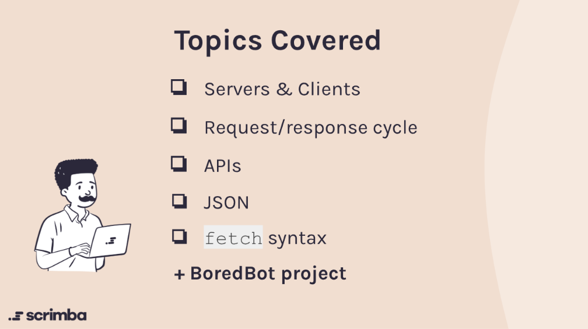

</details>

---

## 📡 Chapter 15: HTTP Requests

### Core Concept

**HTTP (Hypertext Transfer Protocol)** is the foundational communication protocol of the World Wide Web. It determines an agreed-upon, standard format for transferring hypertext, documents, media, and structured data between **clients** (such as browsers and mobile devices) and **servers**.

- **The Request / Response Cycle:**
  - **Request:** Sent when a client initiates a request asking for a specific resource or action from a server.
  - **Response:** Sent when a server returns a response (indicating success or failure) back to the client with appropriate headers, status codes, and body payload.
- **What is a Protocol?** A protocol is simply an agreed-upon, standardized convention for performing an action so different systems can communicate reliably. In the URL `https://apis.scrimba.com/jsonplaceholder/posts`, the `https` portion declares the protocol used.
- **Key Components of an HTTP Request:**
  1. **Path (URL / Endpoint):** The address targeting the exact resource on the network.
  2. **Method (HTTP Verb):** The action to be taken on the server:
     - `GET`: Retrieve existing data or resources (the default method used by `fetch()`).
     - `POST`: Send new data to the server to create a new resource.
     - `PUT`: Replace or update an entire existing resource.
     - `DELETE`: Remove a specified resource from the server.
     - *Others:* `PATCH` (apply partial modifications), `OPTIONS` (check server communication capabilities), etc.
  3. **Body:** The payload data included in the request (commonly serialized as JSON in `POST` or `PUT` calls).
  4. **Headers:** Key-value metadata passed along with the request providing context (e.g., `Content-Type: application/json`, auth tokens, accepted encodings).

### 💡 Visualizations

<details>
  <summary><b>📷 Expand to View HTTP Requests & Protocol Diagrams</b></summary>
  <br>

### 1. Request / Response Cycle

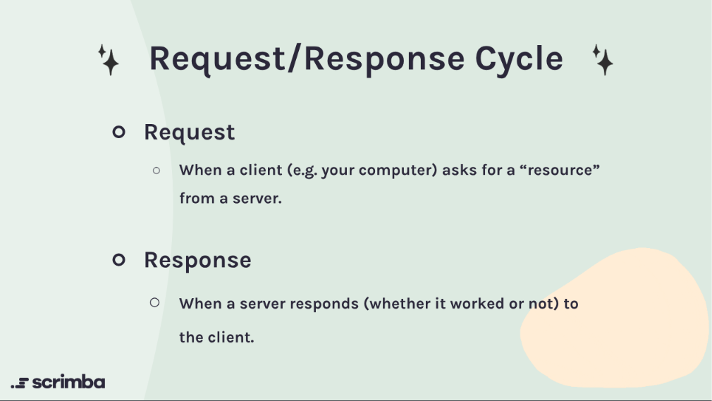

### 2. What is a Protocol & HTTP?

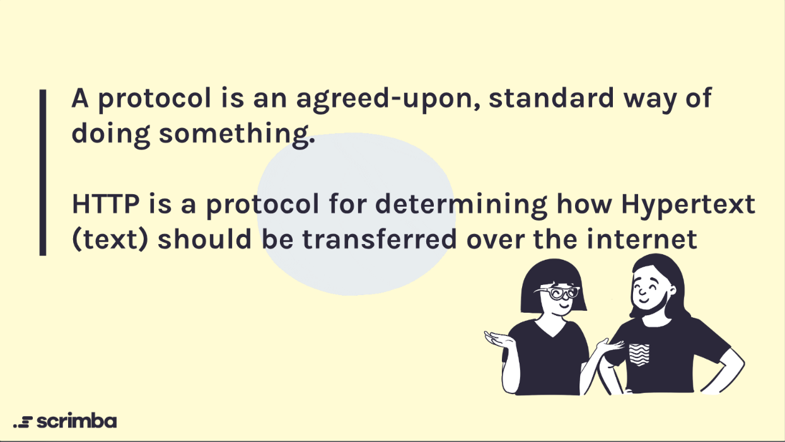

### 3. Components of a Request

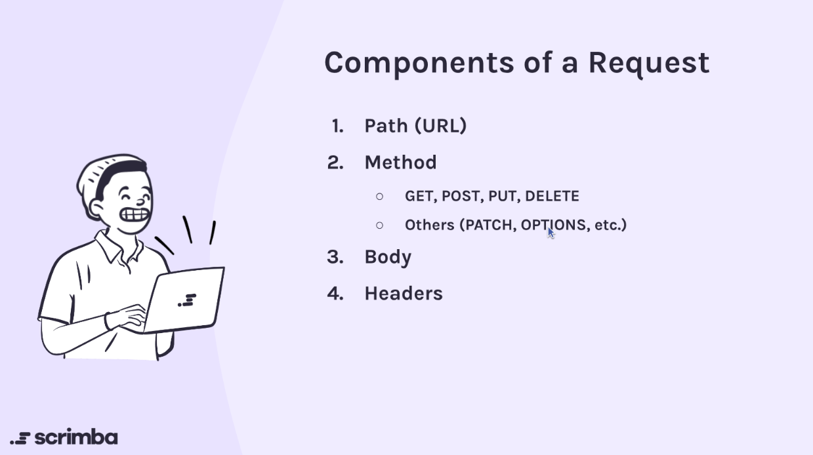

</details>

### 📝 Quiz & Recap

_(Original file: [quiz.md](<file:///c:/Users/suyas/Downloads/CODING%281%29/NEXTGEN-CODE/05-07-2026/APIs%20and%20Async%20JavaScript/URLs%20and%20REST/HTTP%20Requests/quiz.md>))_

> [!NOTE]
> **What does HTTP stand for?**
>
> - **Answer:** **Hypertext Transfer Protocol**

> [!TIP]
> **How would you describe what a protocol is to a complete newbie?**
>
> - **Answer:** An agreed-upon, standard way of doing something.

> [!IMPORTANT]
> **Which part of this URL describes the protocol?**
> `https://apis.scrimba.com/jsonplaceholder/posts`
>
> - **Answer:** `https` (Hypertext Transfer Protocol Secure).

> [!NOTE]
> **Which request method (GET, POST, PUT, DELETE) is used when requesting data from the JSON Placeholder API?**
>
> - **Answer:** **GET** — by default, `fetch()` issues a `GET` request when retrieving resources from an API endpoint.

### 💻 Code Implementation

You can explore the source files for this practice below:

- [index.html](<file:///c:/Users/suyas/Downloads/CODING%281%29/NEXTGEN-CODE/05-07-2026/APIs%20and%20Async%20JavaScript/URLs%20and%20REST/HTTP%20Requests/index.html>) - Structural markup loading the script.
- [index.js](<file:///c:/Users/suyas/Downloads/CODING%281%29/NEXTGEN-CODE/05-07-2026/APIs%20and%20Async%20JavaScript/URLs%20and%20REST/HTTP%20Requests/index.js>) - JavaScript logic initiating a fetch request to the JSONPlaceholder API.
- [index.css](<file:///c:/Users/suyas/Downloads/CODING%281%29/NEXTGEN-CODE/05-07-2026/APIs%20and%20Async%20JavaScript/URLs%20and%20REST/HTTP%20Requests/index.css>) - Background styling for the preview container.
- [quiz.md](<file:///c:/Users/suyas/Downloads/CODING%281%29/NEXTGEN-CODE/05-07-2026/APIs%20and%20Async%20JavaScript/URLs%20and%20REST/HTTP%20Requests/quiz.md>) - Knowledge check on protocols and HTTP methods.

```javascript
// Sending a GET request to JSON Placeholder API
fetch("https://apis.scrimba.com/jsonplaceholder/posts")
  .then((response) => response.json())
  .then((data) => console.log(data));
```

### 🔗 Chapter 15 Resources

- 📄 **JSONPlaceholder Documentation:** [JSONPlaceholder Guide](https://jsonplaceholder.typicode.com/) — Free fake online REST API for testing and prototyping.
- 📄 **MDN Web Docs:** [An Overview of HTTP](https://developer.mozilla.org/en-US/docs/Web/HTTP/Overview) — Core concepts, messages, and architecture of HTTP.
- 📄 **MDN Web Docs:** [HTTP Request Methods](https://developer.mozilla.org/en-US/docs/Web/HTTP/Methods) — Complete reference for GET, POST, PUT, DELETE, and more.
- 📄 **API Endpoint:** [JSONPlaceholder Posts (Scrimba Proxy)](https://apis.scrimba.com/jsonplaceholder/posts)

---

## 🎯 Chapter 16: Requests — URLs and Endpoints

### Core Concept

When making API requests, properly structuring the target address is essential for retrieving or manipulating the correct resources. Every web request targets an address made up of a **Base URL** and a specific **Endpoint**.

- **Base URL vs. Endpoint:**
  - **Base URL:** The fixed root address of the API service that remains constant across different calls (e.g., `https://apis.scrimba.com/jsonplaceholder` or `https://blahblahblah.com/api/v2`).
  - **Endpoint:** The dynamic path suffix that points to the specific resource, entity, or collection you want to access (e.g., `/posts`, `/users`, `/products`, or `/products/123`).
  - **Full Request URL:** Combining the Base URL and the Endpoint forms the complete destination address:
    $$
    \text{Full URL} = \text{Base URL} + \text{Endpoint}
    $$

    *Example:* `https://apis.scrimba.com/jsonplaceholder` + `/posts` $\rightarrow$ `https://apis.scrimba.com/jsonplaceholder/posts`
- **Inspecting JSON in the Browser:**
  - Pasting an API endpoint URL directly into your browser triggers a `GET` request, and the server returns raw JSON text.
  - Browser extensions like **JSON Formatter** make inspecting this response effortless by formatting the raw text into a color-coded, collapsible tree structure.

### 💡 Visualizations

<details>
  <summary><b>📷 Expand to View URLs & Endpoints Diagrams</b></summary>
  <br>

### 1. Path (URL): Base URL vs. Endpoint

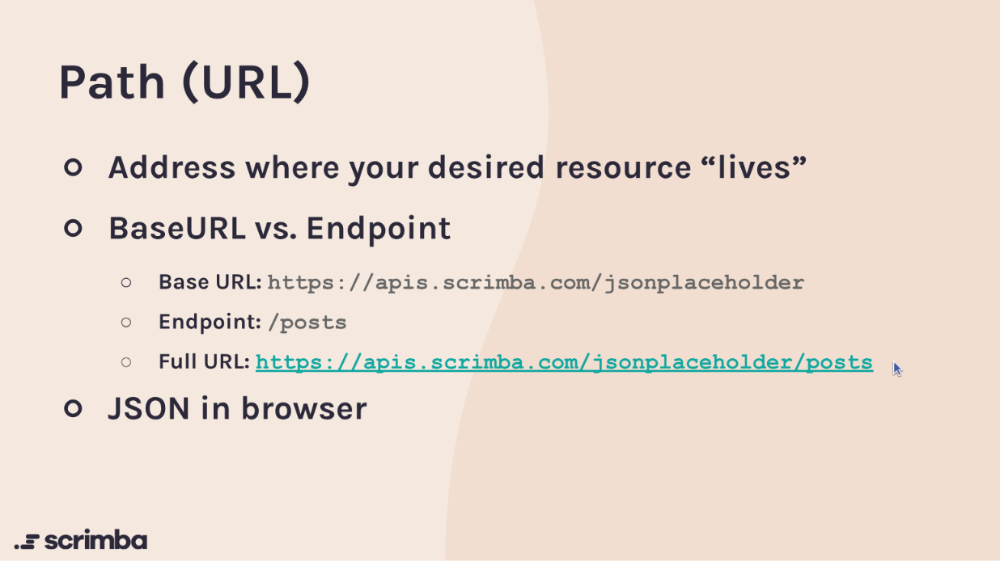

### 2. Inspecting JSON in the Browser

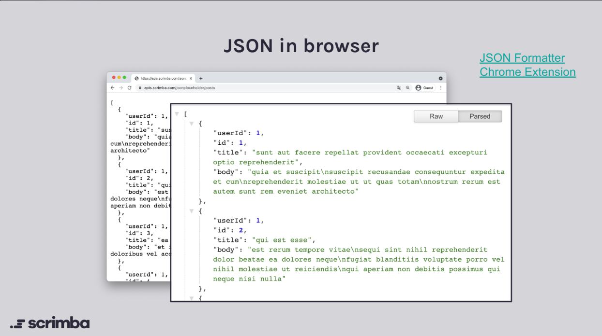

</details>

### 📝 Quiz & Recap

_(Original file: [quiz.md](<file:///c:/Users/suyas/Downloads/CODING%281%29/NEXTGEN-CODE/05-07-2026/APIs%20and%20Async%20JavaScript/URLs%20and%20REST/Requests%20-%20URLs%20and%20Endpoints/quiz.md>))_

> [!NOTE]
> **What is the difference between a Base URL and an Endpoint?**
>
> - **Base URL:** The part of the URL that won't change, no matter which resource we want to get from the API.
> - **Endpoint:** Specifies exactly which resource we want to get from the API.

> [!TIP]
> **Given the following example URLs:**
>
> - `https://blahblahblah.com/api/v2/users`
> - `https://blahblahblah.com/api/v2/products`
> - `https://blahblahblah.com/api/v2/products/123`
>
> **Which part is the Base URL?**
>
> - **Answer:** `https://blahblahblah.com/api/v2`

> [!IMPORTANT]
> **From the example URLs above, what are the available endpoints?**
>
> - **Answer:** `/users`, `/products`, `/products/<some-id-of-a-product-here>` (e.g., `/products/123`).

### 💻 Code Implementation

You can explore the source files for this practice below:

- [quiz.md](<file:///c:/Users/suyas/Downloads/CODING%281%29/NEXTGEN-CODE/05-07-2026/APIs%20and%20Async%20JavaScript/URLs%20and%20REST/Requests%20-%20URLs%20and%20Endpoints/quiz.md>) - Knowledge check on Base URLs and Endpoints.
- [README.md](<file:///c:/Users/suyas/Downloads/CODING%281%29/NEXTGEN-CODE/05-07-2026/APIs%20and%20Async%20JavaScript/URLs%20and%20REST/Requests%20-%20URLs%20and%20Endpoints/README.md>) - Setup guide and documentation.
- [package.json](<file:///c:/Users/suyas/Downloads/CODING%281%29/NEXTGEN-CODE/05-07-2026/APIs%20and%20Async%20JavaScript/URLs%20and%20REST/Requests%20-%20URLs%20and%20Endpoints/package.json>) - Project scripts and configuration.

```javascript
// Base URL and Endpoint separation pattern
const baseURL = "https://apis.scrimba.com/jsonplaceholder";
const endpoint = "/posts";

// Resulting request URL: https://apis.scrimba.com/jsonplaceholder/posts
fetch(`${baseURL}${endpoint}`)
  .then((response) => response.json())
  .then((data) => console.log(data));
```

### 🔗 Chapter 16 Resources

- 🧩 **Chrome Extension:** [JSON Formatter](https://chromewebstore.google.com/detail/json-formatter/bcjindcccaagfpapjjmafapmmgkkhgoa) — Popular browser extension to format and explore JSON responses directly in Google Chrome.
- 📄 **MDN Web Docs:** [What is a URL?](https://developer.mozilla.org/en-US/docs/Learn/Common_questions/Web_mechanics/What_is_a_URL) — Understanding URL syntax, hosts, and paths.
- 📄 **JSONPlaceholder:** [Available Endpoints Guide](https://jsonplaceholder.typicode.com/) — Reference for `/posts`, `/comments`, `/albums`, `/photos`, `/todos`, and `/users`.
---

## 📤 Chapter 17: Requests — Methods

### Core Concept

HTTP methods (also referred to as **HTTP Verbs**) indicate the specific action that the client wants to perform on a given resource. Understanding and utilizing the correct method is fundamental to RESTful API design.

- **The Primary HTTP Methods:**
  - **`GET` (Retrieve Data):** Used to request and retrieve data from a server without causing any side effects or changing server state (safe and idempotent). This is the default method executed when calling `fetch()` without additional options.
  - **`POST` (Add New Data):** Used to submit data to the server to create a new resource (e.g., submitting form data, uploading a file, publishing a new post).
  - **`PUT` (Update Existing Data):** Used to update or replace an existing resource completely on the server (e.g., modifying profile details, updating an item status).
  - **`DELETE` (Remove Data):** Used to remove or delete an existing resource from the server.
  - **Other Methods:** `PATCH` (applying partial modifications to a resource), `OPTIONS` (describing communication options for the target resource).
- **Explicit Method Configuration in `fetch()`:**
  - While `fetch(url)` performs a `GET` request by default, the method can be explicitly defined by passing an options configuration object as the second parameter:
    ```javascript
    fetch(url, { method: "GET" })
    ```

### 💡 Visualizations

<details>
  <summary><b>📷 Expand to View HTTP Request Methods Diagram</b></summary>
  <br>

### 1. HTTP Methods Overview

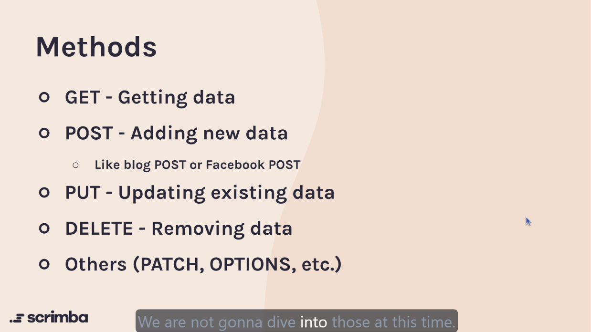

</details>

### 📝 Quiz & Recap

_(Original file: [quiz.md](<file:///c:/Users/suyas/Downloads/CODING%281%29/NEXTGEN-CODE/05-07-2026/APIs%20and%20Async%20JavaScript/URLs%20and%20REST/Requests%20-%20Methods/quiz.md>))_

> [!NOTE]
> **Real-world scenarios for each of the four main HTTP methods:**
>
> - **`GET` (Retrieve):** Checking the current weather forecast on your phone.
> - **`POST` (Create):** Creating and uploading a new screencast video or submitting a registration form.
> - **`PUT` (Update):** Marking tasks on a shared todo list as "completed".
> - **`DELETE` (Remove):** Deleting an accidental or obsolete chat message on Slack or Discord.

### 💻 Code Implementation

You can explore the source files for this practice below:

- [index.html](<file:///c:/Users/suyas/Downloads/CODING%281%29/NEXTGEN-CODE/05-07-2026/APIs%20and%20Async%20JavaScript/URLs%20and%20REST/Requests%20-%20Methods/index.html>) - Simple HTML wrapper.
- [index.js](<file:///c:/Users/suyas/Downloads/CODING%281%29/NEXTGEN-CODE/05-07-2026/APIs%20and%20Async%20JavaScript/URLs%20and%20REST/Requests%20-%20Methods/index.js>) - Explicitly setting `{ method: "GET" }` in the fetch options object.
- [quiz.md](<file:///c:/Users/suyas/Downloads/CODING%281%29/NEXTGEN-CODE/05-07-2026/APIs%20and%20Async%20JavaScript/URLs%20and%20REST/Requests%20-%20Methods/quiz.md>) - Knowledge check on HTTP method real-world usage.

```javascript
// Explicitly setting the request method to GET in fetch
fetch("https://apis.scrimba.com/jsonplaceholder/todos", {
  method: "GET",
})
  .then((res) => res.json())
  .then((data) => console.log(data));
```

### 🔗 Chapter 17 Resources

- 📄 **MDN Web Docs:** [HTTP Request Methods](https://developer.mozilla.org/en-US/docs/Web/HTTP/Methods) — In-depth guide to HTTP request verbs, safety, and idempotence.
- 📄 **MDN Web Docs:** [Fetch API Options & Init](https://developer.mozilla.org/en-US/docs/Web/API/fetch#options) — Complete specification of `fetch()` parameters and request headers.
- 📄 **API Endpoint:** [JSONPlaceholder Todos Endpoint (Scrimba Proxy)](https://apis.scrimba.com/jsonplaceholder/todos)

---

## 📝 Chapter 18: BlogSpace — GET First 5 Blog Posts

### Core Concept

In this chapter, we kick off the **BlogSpace** project — an interactive blogging web application that communicates with a REST API to fetch, create, and manage blog posts.

- **Client-Side Data Truncation (`.slice()`):**
  - Often, API endpoints like `/posts` return large collections (e.g., 100 post objects).
  - To prevent performance bottlenecks or overwhelming the user interface, we can extract a specific subset using JavaScript's native array method: `data.slice(0, 5)`.
  - `.slice(start, end)` returns a shallow copy of a portion of the array from index `start` up to (but not including) index `end`.
- **Inspecting Blog Post Schema:**
  - Each item returned by the JSONPlaceholder `/posts` endpoint adheres to a standardized schema:
    - `userId` (number): ID of the user author.
    - `id` (number): Unique identifier for the specific post.
    - `title` (string): Title headline of the article.
    - `body` (string): Main textual body content.

### 📝 Key Takeaway

> [!TIP]
> **Why use `.slice(0, 5)` on API results?**
>
> When APIs do not support URL query parameters for server-side pagination (such as `?_limit=5`), using `data.slice(0, 5)` allows the frontend client to extract only the needed initial records, keeping state management clean and DOM rendering performant.

### 💻 Code Implementation

You can explore the source files for this practice below:

- [index.html](<file:///c:/Users/suyas/Downloads/CODING%281%29/NEXTGEN-CODE/05-07-2026/APIs%20and%20Async%20JavaScript/URLs%20and%20REST/BlogSpace%20-%20GET%20first%205%20blog%20posts/index.html>) - Baseline HTML template linking the script.
- [index.js](<file:///c:/Users/suyas/Downloads/CODING%281%29/NEXTGEN-CODE/05-07-2026/APIs%20and%20Async%20JavaScript/URLs%20and%20REST/BlogSpace%20-%20GET%20first%205%20blog%20posts/index.js>) - Logic initiating a GET request and truncating the results array to 5 items.
- [package.json](<file:///c:/Users/suyas/Downloads/CODING%281%29/NEXTGEN-CODE/05-07-2026/APIs%20and%20Async%20JavaScript/URLs%20and%20REST/BlogSpace%20-%20GET%20first%205%20blog%20posts/package.json>) - Project metadata and dev server configuration.

```javascript
// GET a list of blog posts and limit to the first 5 entries
fetch("https://apis.scrimba.com/jsonplaceholder/posts")
  .then((res) => res.json())
  .then((data) => {
    const postsArr = data.slice(0, 5);
    console.log(postsArr);
  });
```

### 🔗 Chapter 18 Resources

- 📄 **MDN Web Docs:** [Array.prototype.slice()](https://developer.mozilla.org/en-US/docs/Web/JavaScript/Reference/Global_Objects/Array/slice) — Syntax, parameters, and examples for extracting array segments.
- 📄 **API Endpoint:** [JSONPlaceholder Posts Endpoint (Scrimba Proxy)](https://apis.scrimba.com/jsonplaceholder/posts) — Mock REST endpoint serving blog post records.
- 📄 **JSONPlaceholder:** [Posts Resource Guide](https://jsonplaceholder.typicode.com/) — Reference for blog post object schema and relations.

---

## 🖥️ Chapter 19: BlogSpace — Display Blogs on Page

### Core Concept

In this chapter, we bridge the gap between network requests and visual rendering by dynamically generating and injecting HTML markup for the fetched blog posts directly into the browser DOM.

- **Dynamic DOM Rendering Pipeline:**
  1. **Fetch & Slice:** Query the `/posts` endpoint and limit the payload to the top 5 articles with `data.slice(0, 5)`.
  2. **String Accumulator Pattern:** Initialize an empty string (`let html = ""`) and iterate through the post objects using a `for...of` loop.
  3. **Template Literal Interpolation:** Construct HTML markup using ES6 template literals inserting `${post.title}` and `${post.body}` inside designated semantic tags (`<h3>`, `<p>`, `<hr />`).
  4. **Single-Pass DOM Injection:** Assign the accumulated string to `document.getElementById("blog-list").innerHTML = html` in one single operation.
- **Performance Optimization:**
  - Manipulating the DOM triggers browser layout recalculations and repaints. Modifying `.innerHTML` inside the loop causes 5 separate layout reflows. Accumulating the string first and performing a single write at the end ensures maximum rendering performance.

### 📝 Key Takeaway

> [!TIP]
> **Batch DOM Updates for High Performance:**
> Never mutate `.innerHTML` inside a loop (`element.innerHTML += ...`). Always accumulate the full HTML string in a local JavaScript variable first, then perform a single assignment to `.innerHTML` once the loop completes to minimize expensive DOM reflows.

### 💻 Code Implementation

You can explore the source files for this practice below:

- [index.html](<file:///c:/Users/suyas/Downloads/CODING%281%29/NEXTGEN-CODE/05-07-2026/APIs%20and%20Async%20JavaScript/URLs%20and%20REST/BlogSpace%20-%20Display%20blogs%20on%20page/index.html>) - Markup providing the `#blog-list` container div.
- [index.js](<file:///c:/Users/suyas/Downloads/CODING%281%29/NEXTGEN-CODE/05-07-2026/APIs%20and%20Async%20JavaScript/URLs%20and%20REST/BlogSpace%20-%20Display%20blogs%20on%20page/index.js>) - Logic iterating over sliced posts and injecting compiled HTML into the page.
- [package.json](<file:///c:/Users/suyas/Downloads/CODING%281%29/NEXTGEN-CODE/05-07-2026/APIs%20and%20Async%20JavaScript/URLs%20and%20REST/BlogSpace%20-%20Display%20blogs%20on%20page/package.json>) - Project scripts and configuration.

```javascript
// Fetch, accumulate HTML markup, and batch render into the DOM
fetch("https://apis.scrimba.com/jsonplaceholder/posts")
  .then((res) => res.json())
  .then((data) => {
    const postsArr = data.slice(0, 5);
    let html = "";
    for (let post of postsArr) {
      html += `
        <h3>${post.title}</h3>
        <p>${post.body}</p>
        <hr />
      `;
    }
    document.getElementById("blog-list").innerHTML = html;
  });
```

### 🔗 Chapter 19 Resources

- 📄 **MDN Web Docs:** [Template Literals](https://developer.mozilla.org/en-US/docs/Web/JavaScript/Reference/Template_literals) — Syntax, multiline strings, and expression interpolation.
- 📄 **MDN Web Docs:** [Element.innerHTML](https://developer.mozilla.org/en-US/docs/Web/API/Element/innerHTML) — Best practices, security considerations, and usage of `innerHTML`.
- 📄 **API Endpoint:** [JSONPlaceholder Posts Endpoint (Scrimba Proxy)](https://apis.scrimba.com/jsonplaceholder/posts)

---

## 🎨 Chapter 20: BlogSpace — Add Styling

### Core Concept

In this chapter, we elevate the visual presentation of **BlogSpace** by introducing modern typography, flex-based alignment, and fixed layout positioning.

- **Fixed Navigation Bar (`position: fixed`):**
  - Pinning a navigation bar `<nav>` to the top of the browser screen (`position: fixed`, `width: 100%`, `height: 30px`).
  - Leveraging `display: flex` and `align-items: center` to ensure the logo/brand header stays vertically centered across all screen resolutions.
- **Handling Fixed Element Document Flow (Top Offset):**
  - Because `position: fixed` elements are removed from normal document flow, subsequent siblings render at `top: 0` underneath the header.
  - Adding a compensatory top padding on `#blog-list` (`padding: 30px 10px 10px`) creates the necessary offset so article cards remain fully visible below the navbar.
- **Custom Google Fonts Typography:**
  - Importing the **Karla** typeface from Google Fonts via CDN `<link>` tags.
  - Setting a global font family (`font-family: 'Karla', sans-serif`) with zeroed margins for a clean, modern aesthetic.

### 📝 Key Takeaway

> [!TIP]
> **Preventing Content Overlap with Fixed Navbars:**
> Whenever using `position: fixed` on a header or navigation bar, remember that it occupies zero flow height in the DOM. Always add an equivalent `padding-top` or `margin-top` to the subsequent main content container to prevent elements from being hidden behind the header.

### 💻 Code Implementation

You can explore the source files for this practice below:

- [index.html](<file:///c:/Users/suyas/Downloads/CODING%281%29/NEXTGEN-CODE/05-07-2026/APIs%20and%20Async%20JavaScript/URLs%20and%20REST/BlogSpace%20-%20Add%20styling/index.html>) - Markup introducing the fixed `<nav>` bar and Google Fonts links.
- [index.css](<file:///c:/Users/suyas/Downloads/CODING%281%29/NEXTGEN-CODE/05-07-2026/APIs%20and%20Async%20JavaScript/URLs%20and%20REST/BlogSpace%20-%20Add%20styling/index.css>) - CSS rules for typography, flex alignment, and offset padding.
- [index.js](<file:///c:/Users/suyas/Downloads/CODING%281%29/NEXTGEN-CODE/05-07-2026/APIs%20and%20Async%20JavaScript/URLs%20and%20REST/BlogSpace%20-%20Add%20styling/index.js>) - JavaScript logic rendering the styled blog posts.

```css
/* Fixed navbar and offset container styles */
nav {
  background-color: beige;
  padding: 5px;
  height: 30px;
  display: flex;
  align-items: center;
  position: fixed;
  width: 100%;
}

nav > h3 {
  margin: 0;
}

#blog-list {
  padding: 30px 10px 10px; /* Offset to clear the fixed navbar */
}
```

### 🔗 Chapter 20 Resources

- 📄 **Google Fonts:** [Karla Typography](https://fonts.google.com/specimen/Karla) — Modern grotesque sans-serif font family.
- 📄 **MDN Web Docs:** [CSS Positioning - Fixed](https://developer.mozilla.org/en-US/docs/Web/CSS/position#fixed) — Mechanics of viewport-relative positioning.
- 📄 **MDN Web Docs:** [CSS Flexbox Layout](https://developer.mozilla.org/en-US/docs/Web/CSS/CSS_flexible_box_layout/Basic_concepts_of_flexbox) — Alignment and distribution within the navigation bar.


