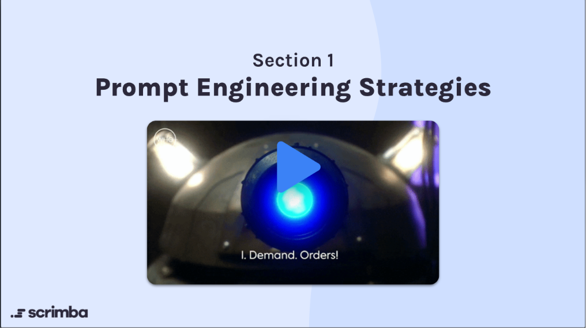
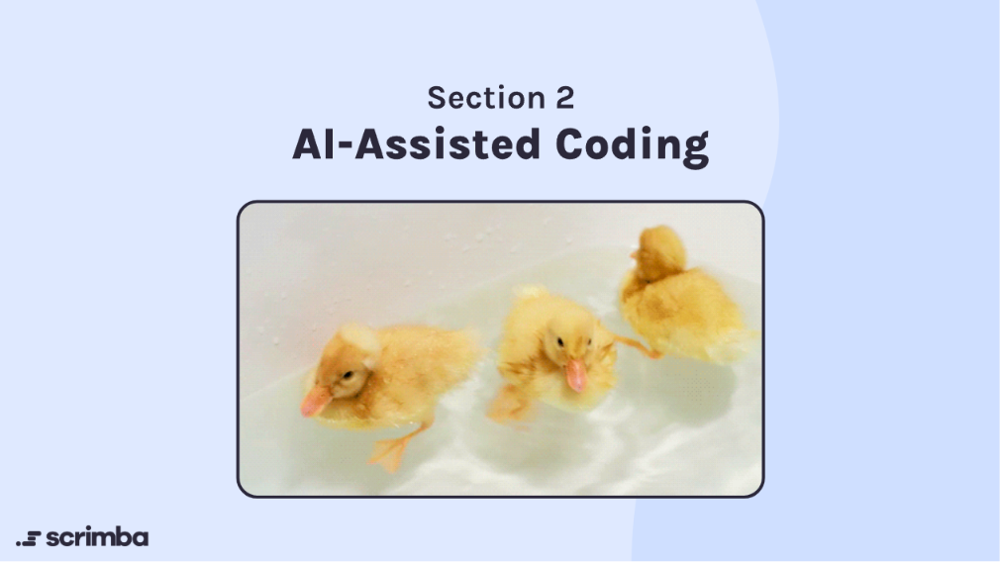
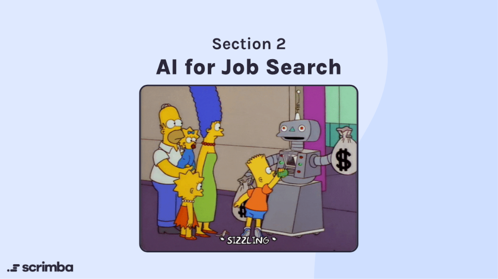
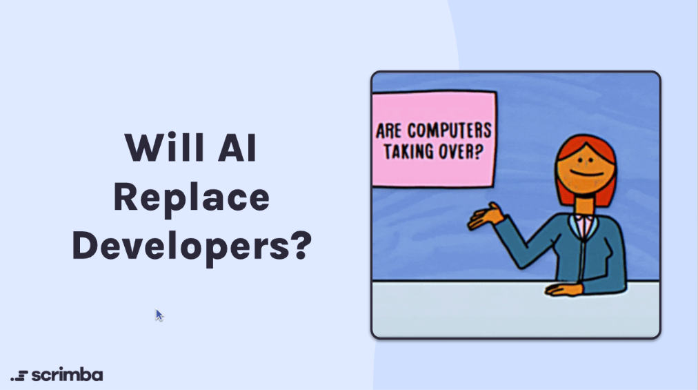
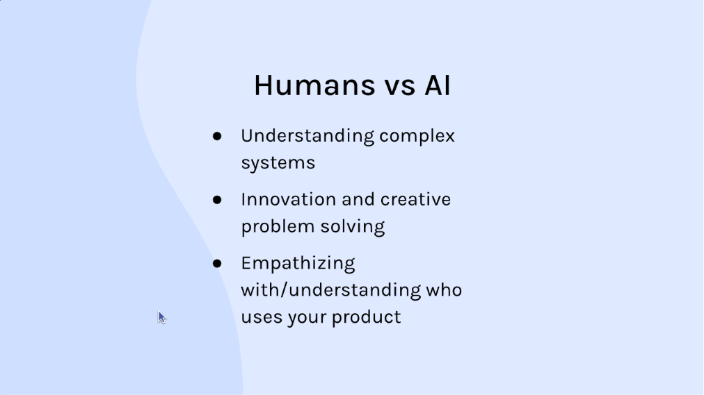
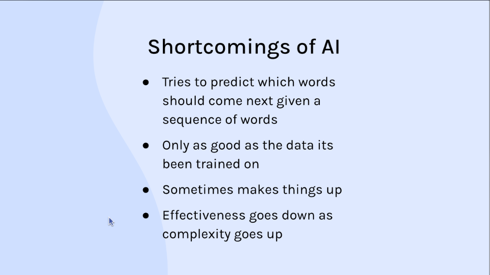
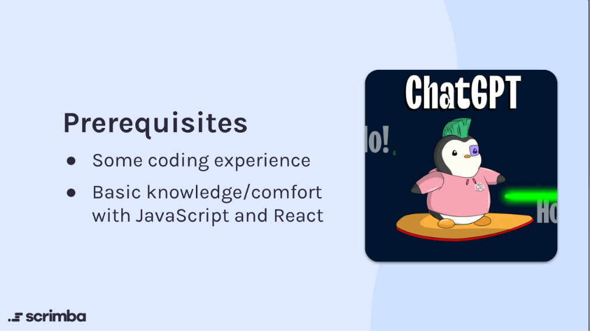
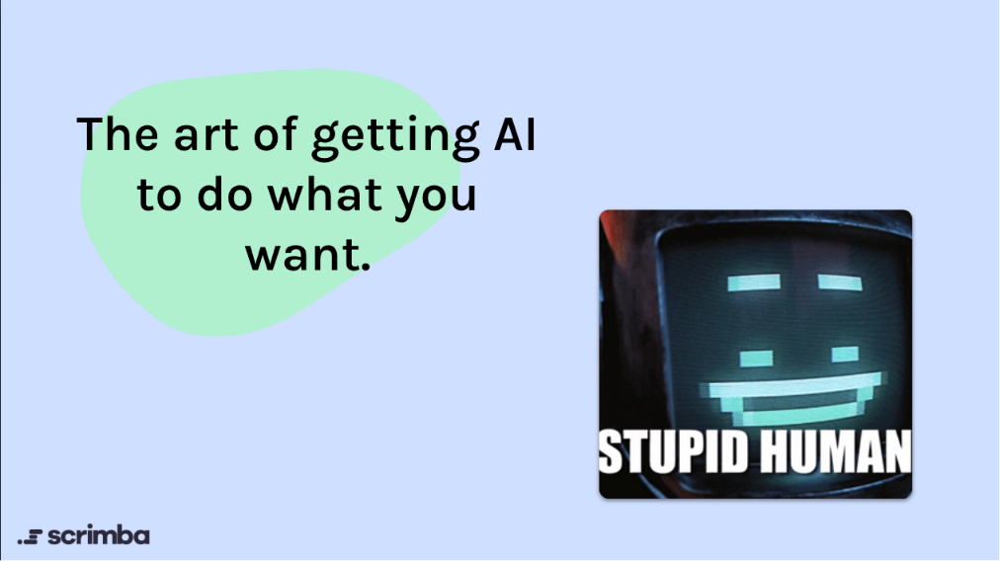
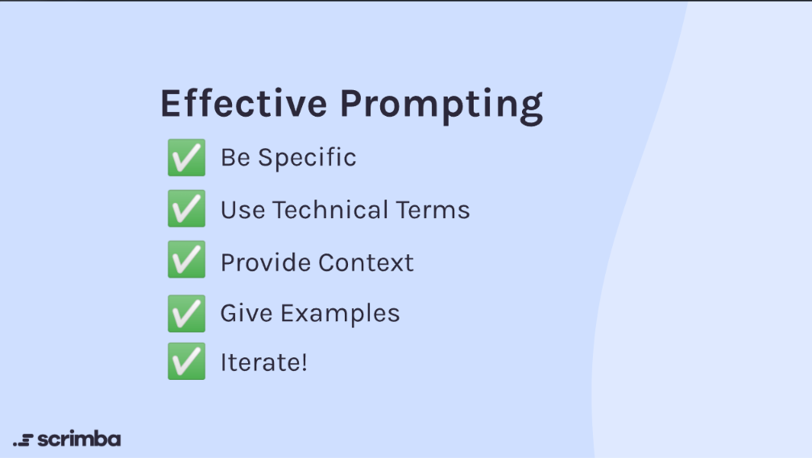

# 🤖 Prompt Engineering for Web Developers

Prompt Engineering is the practice of structuring and optimizing text queries to interact effectively with Artificial Intelligence models. For web developers, this involves using AI tools for code generation, problem-solving, and productivity while understanding their capabilities, boundaries, and best practices.

---

## 📖 Chapter 1: Course Roadmap & Strategies

### Core Concept

Overview of the learning pathway for mastering prompt engineering and leveraging AI tools in modern web development workflows.

- **Section 1:** Prompt Engineering Strategies — foundational techniques, structured prompting, and iterative refinement.
- **Section 2:** AI-Assisted Coding — utilizing AI copilots and models for writing, testing, and refactoring web apps.
- **Section 3:** AI for Job Search — optimizing resumes, mock interviews, and portfolio presentation with AI.

### 💡 Visualizations

<details>
  <summary><b>📷 Expand to View Course Roadmap & Modules</b></summary>
  <br>

#### 1. Section 1 — Prompt Engineering Strategies


#### 2. Section 2 — AI-Assisted Coding


#### 3. Section 3 — AI for Job Search


</details>

### 🔗 Chapter 1 Resources

- 🌐 **Scrimba:** [Prompt Engineering for Web Developers](https://scrimba.com/) — Interactive course modules and tutorials.

---

## 🤖 Chapter 2: Will AI Replace Developers?

### Core Concept

Understanding the complementary relationship between software engineers and AI tools, acknowledging human advantages alongside model shortcomings.

- **Human Strengths:**
  - High-level architecture and understanding complex systems
  - Innovation and creative, out-of-the-box problem solving
  - Empathy and deep understanding of end-user needs
- **Shortcomings of AI:**
  - Token Prediction: Next-word prediction rather than true reasoning
  - Training Data Bounds: Only as reliable as its training corpus
  - Hallucinations: Occasionally produces confident but fabricated outputs
  - Complexity Drop-off: Effectiveness degrades as system architecture complexity grows
- **Prerequisites for Developers:**
  - Practical coding fundamentals
  - Comfort with modern JavaScript & React to critically evaluate AI suggestions

### 💡 Visualizations

<details>
  <summary><b>📷 Expand to View "Will AI Replace Developers?" Visuals</b></summary>
  <br>

#### 1. Will AI Replace Developers?


#### 2. Humans vs. AI


#### 3. Shortcomings of AI


#### 4. Prerequisites


</details>

### 📝 Key Takeaway

> [!IMPORTANT]
> AI is an accelerator, not an autonomous replacement. Developers who master prompting and system design leverage AI to multiply their output while maintaining architectural control.

---

## 🎯 Chapter 3: What is Prompt Engineering?

### Core Concept

Prompt engineering is the art of formulating precise instructions to guide AI models toward accurate, production-ready outputs.

### Effective Prompting Framework

1. ✅ **Be Specific:** Clearly describe requirements, inputs, outputs, and constraints.
2. ✅ **Use Technical Terms:** Use exact terminology (e.g., "REST endpoint", "debounce", "memoization") to narrow context.
3. ✅ **Provide Context:** State framework versions, runtime environments, and file dependencies.
4. ✅ **Give Examples:** Provide few-shot sample inputs and expected outputs for precision.
5. ✅ **Iterate!** Continually refine prompts based on model output to reach optimal solutions.

### 💡 Visualizations

<details>
  <summary><b>📷 Expand to View Prompt Engineering Slides</b></summary>
  <br>

#### 1. What is Prompt Engineering?


#### 2. Effective Prompting Checklist


</details>

### 💻 Code Snippet: Structured Prompt Template

```javascript
// Example: Structured System & User Prompting Pattern
const aiPromptPayload = {
  system: "You are a senior frontend engineer specializing in React and TypeScript.",
  context: "We are building an accessible modal component with keyboard navigation (Esc to close, focus trapping).",
  constraints: [
    "Use Vanilla CSS and semantic HTML",
    "Adhere to WAI-ARIA authoring practices",
    "Do not import external component libraries"
  ],
  task: "Generate the complete, type-safe React modal component."
};
```

### 📝 Quiz & Recap

> [!NOTE]
> **What is the primary goal of prompt engineering?**
>
> - **Answer:** To provide sufficient clarity, context, and constraints to reliably steer AI outputs toward desired results.

> [!TIP]
> **How can you reduce AI hallucinations when coding?**
>
> - **Answer:** Provide explicit constraints, request step-by-step explanations, specify library versions, and test generated code immediately.
