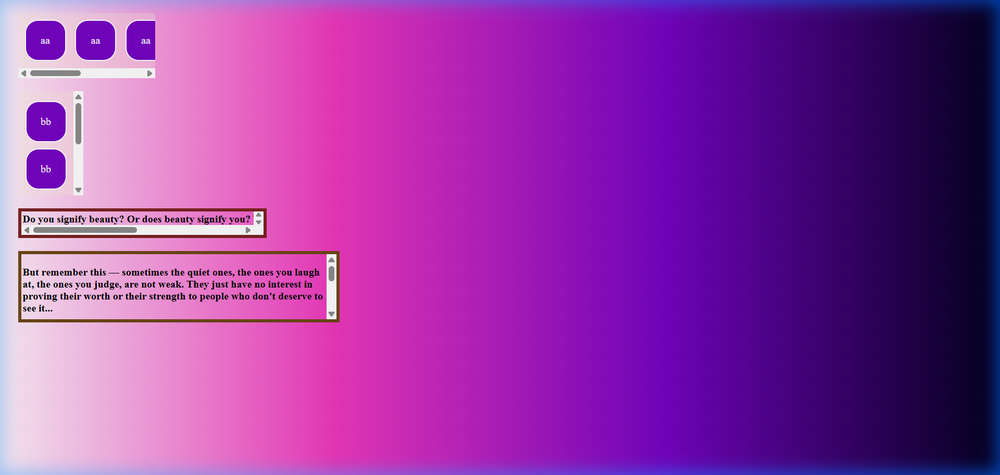
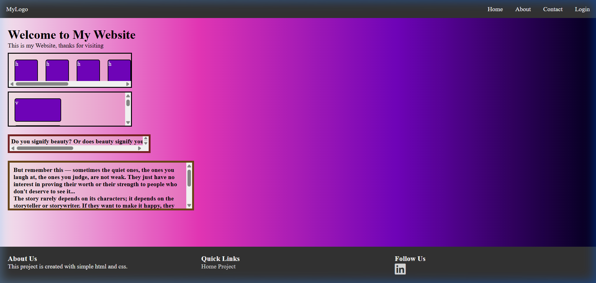

[Jump to Latest](#18-03-2026)

# [13-09-2025](./13-09-2025/)

class,fe &be connection

# [04-10-2025](./04-10-2025/)

use state use case

# [15-10-2025](./15-10-2025/)

creating simple todo app and connect it to backend

npm install -D tailwindcss@3 postcss autoprefixernpx tailwindcss init

useState: useState allows state to be managed within a component useEffect: allows a component to connect with an external system such as an API

# [16-10-2025](./16-10-2025/)

modern portfolio website

# [17-10-2025](./17-10-2025/)

queue

# [18-10-2025](./18-10-2025/)

[https://youtube.com/playlist?list=PL8p2I9GklV471sLqkGuf0eKAu9sVNmKFV&si=SI1fpHA-uzATnl5k](https://youtube.com/playlist?list=PL8p2I9GklV471sLqkGuf0eKAu9sVNmKFV&si=SI1fpHA-uzATnl5k)Tailwind CSS practice upto 8 videos

# [23-10-2025](./23-10-2025/)

[https://scrimba.com/learn-react-c0e/~04xn](https://scrimba.com/learn-react-c0e/~04xn)creating vite project using scrimba

# [27-10-2025](./27-10-2025/)

revising backend

# [29-10-2025](./29-10-2025/)

queue and stack

# [03-11-2025](./03-11-2025/)

Tree

# **[13-11-2025](./13-11-2025/)**

revision old concept and deploying small personal website

[https://sparkling-klepon-3009bb.netlify.app/](https://sparkling-klepon-3009bb.netlify.app/ "https://sparkling-klepon-3009bb.netlify.app/")

# [15-11-2025](./15-11-2025/)

Revising old CSS concepts.

making a project *The Daily Dribble Newsletter*

Building a Digital Business Card
https://suyashbusinesscard.netlify.app/

# [16-11-2025](./16-11-2025/)
making some project with vibe coding, using devdock

# [19-11-2025](./19-11-2025/)

Building a Space Exploration Site
[Deployment](https://sprightly-duckanoo-8b0f25.netlify.app/)

# [04-12-2025](./04-12-2025/)

Learn JavaScript

# [16-12-2025](./16-12-2025/)
Learning JavaScript and Building a simple BlackJack Game
[Deployment](https://suyashsahu00.github.io/Build_a_BlackJack_Game/)

# [21-12-2025](./21-12-2025/)
Practiced JavaScript fundamentals and built small projects (Practice Time - Part 2):

- **Password Generator:** set up with Vite, installed dependencies, and tested running the app (`npm install` / `npm start`).
- **Control flow:** exercises with `if/else` and logical operators.
- **Data structures & loops:** worked with arrays, loops, and array methods (`push`, `pop`, `unshift`, `shift`).
- **Objects & functions:** created reusable functions and object-based examples.
- **Mini-projects & challenges:** EmojiFighter, Sorting Fruits, DOM manipulation tasks, and other small practice exercises.
Deployment: https://suyashsahu00.github.io/password_generator/

# [24-12-2025](./24-12-2025/)
Building a Chrome extension - **Leads Tracker**

A productivity Chrome extension for saving and managing website URLs/leads with the following features:
- **Save Input:** Manually save URLs by typing them into an input field
- **Save Tab:** Quickly save the current active tab's URL with one click using Chrome API
- **LocalStorage Persistence:** All leads are stored in browser's localStorage and persist across sessions
- **Delete All:** Double-click to clear all saved leads
- **Clickable Links:** Each saved lead is rendered as a clickable link that opens in a new tab
- **Template Strings & DOM Manipulation:** Used modern JavaScript features for dynamic rendering

Built with Vite, vanilla JavaScript, and Chrome Extension Manifest V3.

[Deployment](https://suyashsahu00.github.io/lead_tracker/)

# [24-02-2026](./01DEV/24-02-2026/)

Setting up HTML, CSS, and JS boilerplate for upcoming practice sessions.

# [25-02-2026](./01DEV/25-02-2026/)

CSS Practice — Learning CSS properties from basic to advanced through hands-on tasks:

- **Text Styling:** `color`, `font-size`, `text-align`, `text-transform`, `letter-spacing`
- **Box Model:** `padding`, `margin`, `border`, `width`, `border-radius`, `box-sizing`
- **Flexbox:** `display: flex`, `gap`, `justify-content`, `align-items`
- **Hover & Transitions:** `:hover`, `transition`, `transform: scale()`, `transform: translateY()`
- **Shadows & Cursor:** `box-shadow`, `cursor: pointer`
- **Gradients & Fonts:** `linear-gradient`, Google Fonts (`Poppins`), `min-height: 100vh`
- **Positioning:** `position: relative`, `position: absolute`, `top`, `right`
- **Selectors:** element selectors, class selectors (`.box`), nested selectors (`.card h3`)

# [28-02-2026](./01DEV/28-02-2026/)

Advanced CSS Properties - Mastering borders and basic container control:

- **Border Styles:** practiced with `border-style: dotted`, `border-width`, and `border-color`.
- **Horizontal Overflow:** introduced `overflow-x: scroll` to handle wide content in constrained containers.

# [14-03-2026](./01DEV/14-03-2026/)

Horizontal & Vertical Scroll Mechanics - Building advanced scrolling UI elements:

- **Row Scrolling (X-axis):** created infinite-feeling horizontal rows using `white-space: nowrap` and `display: inline-block`.
- **Column Scrolling (Y-axis):** constrained container heights to force vertical scrollbars.
- **Dynamic Shapes:** practice with `border-radius: 50%` to transform square boxes into fluid circles.
- **Animations:** basic `translateX` animations for marquee effects.

  
<b>📷 Click to view Scroll Mechanics</b>

   
  

# [15-03-2026](./01DEV/15-03-2026/)

UI Aesthetics & Modern Backgrounds - Creating high-end visual designs:

- **Mesh Gradients:** used multiple overlapping `radial-gradient` "blobs" with heavy `filter: blur()`.
- **Composition:** practiced with `mix-blend-mode: screen` for glowing, liquid-like color overlaps.
- **Premium Assets:** integrated high-quality 4K background images for sophisticated UI backgrounds.

  
<b>📷 Click to view Flowing Background</b>

   
  

# [17-03-2026](./01DEV/17-03-2026/)

Refined Container Structures - Organizing content within scrolling zones:

- **Nested Layouts:** structuring parent-child relationships (`.p`, `.c`, `.scroll-box`) for better container control.
- **Content Flow:** managing long text vs. stylized square items within different scroll orientations.

# [18-03-2026](./01DEV/18-03-2026/)

Full Web Page Architecture - Building a complete, responsive site layout:

- **Navbar:** implemented a professional navigation bar with Logo, links, and a functional Hamburger ☰ menu.
- **Main Content:** integrated previous scroll box experiments into a cohesive central content area.
- **Footer:** added a structured footer with Quick Links and social media icons using FontAwesome.
- **Responsive Elements:** practiced layout scaling for differnet screen sizes.

  
<b>📷 Click to view Website Layout</b>

   
  

