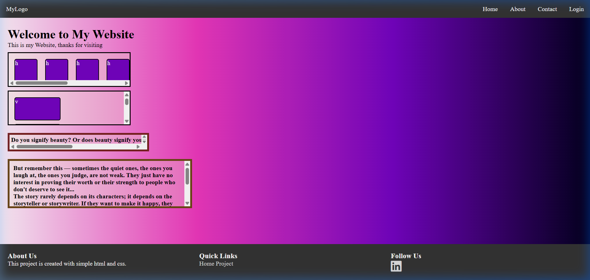

<div align="center">

# ⚡ NEXTGEN-CODE
### Full-Stack Web Development, Data Structures & AI Engineering Log

[](https://developer.mozilla.org/en-US/docs/Web/JavaScript)
[](https://react.dev/)
[](https://tailwindcss.com/)
[](https://vitejs.dev/)
[](https://isocpp.org/)
[](https://firebase.google.com/)

<p align="center">
  A chronological learning log capturing modern frontend architecture, core algorithms, asynchronous engineering, responsive design systems, and AI-assisted programming.
</p>

[📑 Jump to Date Index](#-date-directory--quick-access-index) &nbsp;·&nbsp;
[⚡ Jump to Latest Chapter](#04-09-2026) &nbsp;·&nbsp;
[🧠 DSA Tracker](./02DSA/ReadmeDSA.md) &nbsp;·&nbsp;
[💻 Dev Log](./01DEV/ReadmeDEV.md)

</div>

---

## 📑 Date Directory & Quick Access Index

Browse any date folder below to see what concept, project, or architecture was tackled. Click the **Folder Link** to navigate directly into the code directory or click **Chapter Link** to read the notes and code snippets.

| Date | Module / Project | Focus & Core Technologies | Folder Link | Chapter Jump |
|:---|:---|:---|:---:|:---:|
| **13-09-2025** | Frontend & Backend Connection | Client-server architecture, Express classes, API calls | [📂 `13-09-2025`](./13-09-2025/) | [📖 Chapter 1](#13-09-2025) |
| **04-10-2025** | React `useState` Mechanics | State lifecycle, component re-rendering, event handlers | [📂 `04-10-2025`](./04-10-2025/) | [📖 Chapter 2](#04-10-2025) |
| **15-10-2025** | Fullstack Todo App | React state, Tailwind CSS v3, Express API integration | [📂 `15-10-2025`](./15-10-2025/) | [📖 Chapter 3](#15-10-2025) |
| **16-10-2025** | Modern Portfolio Website | Responsive grid, semantic HTML5, visual typography | [📂 `16-10-2025`](./16-10-2025/) | [📖 Chapter 4](#16-10-2025) |
| **17-10-2025** | Queue Data Structure | FIFO queue operations, enqueue/dequeue mechanics | [📂 `17-10-2025`](./17-10-2025/) | [📖 Chapter 5](#17-10-2025) |
| **18-10-2025** | Tailwind CSS Practice Suite | Utility classes, responsive breakpoints, flex layouts | [📂 `18-10-2025`](./18-10-2025/) | [📖 Chapter 6](#18-10-2025) |
| **23-10-2025** | React Tooling with Vite | Scrimba React curriculum, Vite dev server, JSX | [📂 `23-10-2025`](./23-10-2025/) | [📖 Chapter 7](#23-10-2025) |
| **27-10-2025** | Backend Revision & Routing | Node.js routing, controller architecture, middleware | [📂 `27-10-2025`](./27-10-2025/) | [📖 Chapter 8](#27-10-2025) |
| **29-10-2025** | Queue & Stack Data Structures | Memory layouts, LIFO & FIFO pointer management | [📂 `29-10-2025`](./29-10-2025/) | [📖 Chapter 9](#29-10-2025) |
| **03-11-2025** | Tree Data Structures | Hierarchical non-linear structures, node traversal | [📂 `03-11-2025`](./03-11-2025/) | [📖 Chapter 10](#03-11-2025) |
| **13-11-2025** | Personal Web App & Deployment | Web concepts revision, Netlify live cloud deployment | [📂 `13-11-2025`](./13-11-2025/) | [📖 Chapter 11](#13-11-2025) |
| **15-11-2025** | The Daily Dribble & Digital Business Card | CSS box models, card components, responsive layouts | [📂 `15-11-2025`](./15-11-2025/) | [📖 Chapter 12](#15-11-2025) |
| **16-11-2025** | DevDock Vibe Coding | AI-assisted development workflow & rapid prototyping | [📂 `16-11-2025`](./16-11-2025/) | [📖 Chapter 13](#16-11-2025) |
| **19-11-2025** | Space Exploration Portal | Cosmic UI design, responsive images, CSS layout | [📂 `19-11-2025`](./19-11-2025/) | [📖 Chapter 14](#19-11-2025) |
| **04-12-2025** | JavaScript Core Foundations | Variables, types, functions, control flow basics | [📂 `04-12-2025`](./04-12-2025/) | [📖 Chapter 15](#04-12-2025) |
| **16-12-2025** | Blackjack Interactive Card Game | Game state machine, DOM event handling, arrays | [📂 `16-12-2025`](./16-12-2025/) | [📖 Chapter 16](#16-12-2025) |
| **21-12-2025** | Password Generator & Practice Lab | Array methods, character algorithms, Vite packaging | [📂 `21-12-2025`](./21-12-2025/) | [📖 Chapter 17](#21-12-2025) |
| **24-12-2025** | Leads Tracker Chrome Extension | Chrome Manifest V3, `chrome.tabs`, `localStorage` | [📂 `24-12-2025`](./24-12-2025/) | [📖 Chapter 18](#24-12-2025) |
| **24-02-2026** | Dev Environment & Boilerplates | Modern HTML5/CSS3/JS modular architecture | [📂 `01DEV/24-02-2026`](./01DEV/24-02-2026/) | [📖 Chapter 19](#24-02-2026) |
| **25-02-2026** | Advanced CSS Design Properties | Typography, box model, Flexbox, transitions & hovers | [📂 `01DEV/25-02-2026`](./01DEV/25-02-2026/) | [📖 Chapter 20](#25-02-2026) |
| **28-02-2026** | Border Styling & Overflow Controls | `border-style`, container sizing, horizontal scrolling | [📂 `01DEV/28-02-2026`](./01DEV/28-02-2026/) | [📖 Chapter 21](#28-02-2026) |
| **14-03-2026** | Horizontal & Vertical Scroll Systems | Infinite row scrolling, container constraints, animations | [📂 `01DEV/14-03-2026`](./01DEV/14-03-2026/) | [📖 Chapter 22](#14-03-2026) |
| **15-03-2026** | Mesh Gradients & 4K Visual Assets | `radial-gradient` blobs, `mix-blend-mode`, 4K assets | [📂 `01DEV/15-03-2026`](./01DEV/15-03-2026/) | [📖 Chapter 23](#15-03-2026) |
| **17-03-2026** | Refined Layout Containers | Parent-child nesting, scroll zones, content flow | [📂 `01DEV/17-03-2026`](./01DEV/17-03-2026/) | [📖 Chapter 24](#17-03-2026) |
| **18-03-2026** | Full Responsive Web Architecture | Navbar with Hamburger menu, content grid, footer | [📂 `01DEV/18-03-2026`](./01DEV/18-03-2026/) | [📖 Chapter 25](#18-03-2026) |
| **25-03-2026** | Accessible Web Development (A11y) | WAI-ARIA, skip links, contrast, semantic elements | [📂 `25-03-2026`](./25-03-2026/) | [📖 Chapter 26](#25-03-2026) |
| **05-07-2026** | APIs & Asynchronous JavaScript | REST APIs, `fetch()`, async/await, BoredBot app | [📂 `05-07-2026`](./05-07-2026/) | [📖 Chapter 27](#05-07-2026) |
| **13-07-2026** | Prompt Engineering for Developers | Prompt strategies, AI capabilities/limits, LLM workflows | [📂 `13-07-2026`](./13-07-2026/) | [📖 Chapter 28](#13-07-2026) |
| **04-09-2026** | Mobile Web App & Firebase Cloud | Mobile web apps, Firebase SDK, real-time sync | [📂 `04-09-2026`](./04-09-2026/) | [📖 Chapter 29](#04-09-2026) |

---

<a id="13-09-2025"></a>
## 📖 Chapter 1: [13-09-2025](./13-09-2025/) — Frontend & Backend Connection

Connecting modern frontend applications with Node.js and Express backend services using object-oriented classes and HTTP endpoints.

- **Architecture:** Explored full-stack request/response communication.
- **Frontend & Backend:** Setup client-side fetch handlers communicating with Express routes.

```javascript
// Express route handling client connection
app.get("/api/status", (req, res) => {
  res.json({ status: "connected", timestamp: new Date().toISOString() });
});
```

[⬆ Back to Index](#-date-directory--quick-access-index)

---

<a id="04-10-2025"></a>
## 📖 Chapter 2: [04-10-2025](./04-10-2025/) — React `useState` Use Cases

Exploration of React's fundamental reactive state mechanism for handling user interactions and dynamic rendering.

- **Reactive State:** Managing component re-renders based on user inputs.
- **Best Practices:** Updating state immutably and handling previous state references.

```jsx
const [count, setCount] = useState(0);
const increment = () => setCount((prev) => prev + 1);
```

[⬆ Back to Index](#-date-directory--quick-access-index)

---

<a id="15-10-2025"></a>
## 📖 Chapter 3: [15-10-2025](./15-10-2025/) — Fullstack Todo App & Tailwind Setup

Building an interactive Todo application connected to a backend with a Tailwind CSS utility styling pipeline.

- **Tailwind Setup:**
  ```bash
  npm install -D tailwindcss@3 postcss autoprefixer
  npx tailwindcss init
  ```
- **React Hooks Synergy:**
  - `useState`: Handles in-memory task lists and input fields.
  - `useEffect`: Manages synchronization with external backend APIs.

```javascript
useEffect(() => {
  fetch("/api/todos")
    .then((res) => res.json())
    .then((data) => setTodos(data));
}, []);
```

[⬆ Back to Index](#-date-directory--quick-access-index)

---

<a id="16-10-2025"></a>
## 📖 Chapter 4: [16-10-2025](./16-10-2025/) — Modern Portfolio Website

Developing a responsive, high-aesthetic personal portfolio using semantic HTML5 and clean layout techniques.

- **Focus:** Clean hero layouts, responsive cards, and accessible navigation.

[⬆ Back to Index](#-date-directory--quick-access-index)

---

<a id="17-10-2025"></a>
## 📖 Chapter 5: [17-10-2025](./17-10-2025/) — Queue Data Structure

Implementing FIFO (First-In, First-Out) queuing data structures and understanding sequential data scheduling.

- **Key Operations:** `enqueue()`, `dequeue()`, `front()`, and `isEmpty()`.

[⬆ Back to Index](#-date-directory--quick-access-index)

---

<a id="18-10-2025"></a>
## 📖 Chapter 6: [18-10-2025](./18-10-2025/) — Tailwind CSS Practice Suite

Intensive practice with utility-first CSS layouts, mastering Flexbox containers, spacing systems, and responsive prefixes.

### 🔗 Chapter 6 Resources
- 🎥 **Playlist:** [Tailwind CSS Practice Series](https://youtube.com/playlist?list=PL8p2I9GklV471sLqkGuf0eKAu9sVNmKFV&si=SI1fpHA-uzATnl5k)

[⬆ Back to Index](#-date-directory--quick-access-index)

---

<a id="23-10-2025"></a>
## 📖 Chapter 7: [23-10-2025](./23-10-2025/) — Vite + React Development

Setting up blazing-fast modern React tooling with Vite via Scrimba exercises.

### 🔗 Chapter 7 Resources
- 🎓 **Interactive Lesson:** [Learn React on Scrimba](https://scrimba.com/learn-react-c0e/~04xn)

[⬆ Back to Index](#-date-directory--quick-access-index)

---

<a id="27-10-2025"></a>
## 📖 Chapter 8: [27-10-2025](./27-10-2025/) — Backend Architecture Revision

Reviewing server-side fundamentals: Express request/response lifecycles, route parameters, JSON body parsing, and status codes.

[⬆ Back to Index](#-date-directory--quick-access-index)

---

<a id="29-10-2025"></a>
## 📖 Chapter 9: [29-10-2025](./29-10-2025/) — Queues & Stacks

Comparative analysis between LIFO (Last-In, First-Out) Stacks and FIFO (First-In, First-Out) Queues.

- **Applications:** Call stack tracking, undo operations (Stack) vs. print spooling, task queues (Queue).

[⬆ Back to Index](#-date-directory--quick-access-index)

---

<a id="03-11-2025"></a>
## 📖 Chapter 10: [03-11-2025](./03-11-2025/) — Tree Data Structures

Fundamentals of non-linear hierarchical data structures: Root nodes, binary trees, leaf nodes, and traversal algorithms (pre-order, in-order, post-order).

[⬆ Back to Index](#-date-directory--quick-access-index)

---

<a id="13-11-2025"></a>
## 📖 Chapter 11: [13-11-2025](./13-11-2025/) — Personal Website Deployment

Concept revision and continuous deployment of a personal web project to Netlify.

- 🌐 **Live Deployment:** [sparkling-klepon-3009bb.netlify.app](https://sparkling-klepon-3009bb.netlify.app/)

[⬆ Back to Index](#-date-directory--quick-access-index)

---

<a id="15-11-2025"></a>
## 📖 Chapter 12: [15-11-2025](./15-11-2025/) — The Daily Dribble & Digital Business Card

Deep dive into component styling, card typography, and mobile-first container design.

- **The Daily Dribble Newsletter:** Clean editorial layout and responsive forms.
- **Digital Business Card:** Compact UI with social links and visual identity.
- 🌐 **Live Deployment:** [suyashbusinesscard.netlify.app](https://suyashbusinesscard.netlify.app/)

[⬆ Back to Index](#-date-directory--quick-access-index)

---

<a id="16-11-2025"></a>
## 📖 Chapter 13: [16-11-2025](./16-11-2025/) — Vibe Coding with DevDock

Experimenting with AI-driven rapid development workflows ("vibe coding") using DevDock for fast iterative prototypes.

[⬆ Back to Index](#-date-directory--quick-access-index)

---

<a id="19-11-2025"></a>
## 📖 Chapter 14: [19-11-2025](./19-11-2025/) — Space Exploration Site

Designing an immersive space exploration website featuring dark backgrounds, glowing stellar accents, and modern typography.

- 🌐 **Live Deployment:** [sprightly-duckanoo-8b0f25.netlify.app](https://sprightly-duckanoo-8b0f25.netlify.app/)

[⬆ Back to Index](#-date-directory--quick-access-index)

---

<a id="04-12-2025"></a>
## 📖 Chapter 15: [04-12-2025](./04-12-2025/) — Learn JavaScript Core

Mastering JavaScript syntax, variable scopes (`const`, `let`), data types, and arithmetic/logical operations.

[⬆ Back to Index](#-date-directory--quick-access-index)

---

<a id="16-12-2025"></a>
## 📖 Chapter 16: [16-12-2025](./16-12-2025/) — Blackjack Web Game

Developing an interactive Blackjack browser game with score calculation, card dealing logic, and DOM state updates.

- 🌐 **Live Deployment:** [suyashsahu00.github.io/Build_a_BlackJack_Game](https://suyashsahu00.github.io/Build_a_BlackJack_Game/)

```javascript
// Drawing a random card
function getRandomCard() {
  let randomNumber = Math.floor(Math.random() * 13) + 1;
  if (randomNumber > 10) return 10;
  if (randomNumber === 1) return 11;
  return randomNumber;
}
```

[⬆ Back to Index](#-date-directory--quick-access-index)

---

<a id="21-12-2025"></a>
## 📖 Chapter 17: [21-12-2025](./21-12-2025/) — Password Generator & Practice Lab

Comprehensive JavaScript review (Practice Time - Part 2) building mini-tools and utility algorithms:

- **Password Generator:** Vite-bundled app producing secure, random passwords.
- **Control Flow & Loops:** Complex `if/else`, logical operators, and array mutations (`push`, `pop`, `shift`, `unshift`).
- **Challenges:** EmojiFighter, Sorting Fruits, and DOM manipulations.
- 🌐 **Live Deployment:** [suyashsahu00.github.io/password_generator](https://suyashsahu00.github.io/password_generator/)

[⬆ Back to Index](#-date-directory--quick-access-index)

---

<a id="24-12-2025"></a>
## 📖 Chapter 18: [24-12-2025](./24-12-2025/) — Leads Tracker Chrome Extension

A productivity Chrome Extension built with Manifest V3 to save and manage web URLs on the fly:

- **Save Input:** Manual URL saving from input elements.
- **Save Active Tab:** One-click active tab URL capture using the Chrome Extension Tabs API.
- **LocalStorage Persistence:** Browser storage preservation across sessions.
- **Dynamic DOM Rendering:** Template strings rendering clean, clickable hyperlinks.
- 🌐 **Live Deployment:** [suyashsahu00.github.io/lead_tracker](https://suyashsahu00.github.io/lead_tracker/)

```javascript
// Grabbing current active tab URL in Chrome
chrome.tabs.query({ active: true, currentWindow: true }, function (tabs) {
  myLeads.push(tabs[0].url);
  localStorage.setItem("myLeads", JSON.stringify(myLeads));
  render(myLeads);
});
```

[⬆ Back to Index](#-date-directory--quick-access-index)

---

<a id="24-02-2026"></a>
## 📖 Chapter 19: [24-02-2026](./01DEV/24-02-2026/) — Modern Dev Setup & Boilerplates

Configuring scalable HTML5, CSS3, and JavaScript project foundations for development practice sessions.

[⬆ Back to Index](#-date-directory--quick-access-index)

---

<a id="25-02-2026"></a>
## 📖 Chapter 20: [25-02-2026](./01DEV/25-02-2026/) — CSS Practice: Box Model & Typography

In-depth hands-on exercises mastering visual CSS properties:

- **Typography:** `color`, `font-size`, `letter-spacing`, `text-transform`.
- **Box Model:** `padding`, `margin`, `border`, `box-sizing: border-box`.
- **Flexbox & Positioning:** `display: flex`, `gap`, `justify-content`, `position: relative/absolute`.
- **Animations:** `:hover`, `transition`, `transform: scale()`.

[⬆ Back to Index](#-date-directory--quick-access-index)

---

<a id="28-02-2026"></a>
## 📖 Chapter 21: [28-02-2026](./01DEV/28-02-2026/) — Advanced Borders & Horizontal Overflow

Mastering container constraint mechanics:

- **Border Styles:** Practical application of `border-style: dotted`, widths, and colors.
- **Horizontal Overflow:** Using `overflow-x: scroll` to constrain wide layouts without breaking page flow.

[⬆ Back to Index](#-date-directory--quick-access-index)

---

<a id="14-03-2026"></a>
## 📖 Chapter 22: [14-03-2026](./01DEV/14-03-2026/) — Horizontal & Vertical Scroll Mechanics

Building advanced scrolling UI components:

- **Row Scrolling (X-axis):** Using `white-space: nowrap` and `display: inline-block` for smooth horizontal scrolls.
- **Column Scrolling (Y-axis):** Constraining vertical heights to handle overflowing text blocks.
- **Dynamic Shapes:** Circular element transforms using `border-radius: 50%`.

<details>
  <summary><b>📷 Expand to View Scroll Mechanics Preview</b></summary>
  <br>
  
</details>

[⬆ Back to Index](#-date-directory--quick-access-index)

---

<a id="15-03-2026"></a>
## 📖 Chapter 23: [15-03-2026](./01DEV/15-03-2026/) — UI Aesthetics, Mesh Gradients & 4K Backgrounds

Creating high-end visual aesthetics for modern web applications:

- **Mesh Gradients:** Layered `radial-gradient` color blobs with high `filter: blur()`.
- **Blend Modes:** Using `mix-blend-mode: screen` for glowing, organic color transitions.
- **Asset Integration:** Pairing custom 4K background artwork with glassmorphic cards.

<details>
  <summary><b>📷 Expand to View Flowing Background Asset</b></summary>
  <br>
  
</details>

[⬆ Back to Index](#-date-directory--quick-access-index)

---

<a id="17-03-2026"></a>
## 📖 Chapter 24: [17-03-2026](./01DEV/17-03-2026/) — Refined Container Structures

Organizing multi-column and scrollable components within responsive parent-child layouts.

- **Layout Nesting:** Coordinating `.p`, `.c`, and `.scroll-box` containers.
- **Flow Hierarchy:** Balancing fixed square grid elements with flexible content zones.

[⬆ Back to Index](#-date-directory--quick-access-index)

---

<a id="18-03-2026"></a>
## 📖 Chapter 25: [18-03-2026](./01DEV/18-03-2026/) — Full Web Page Architecture

Building a complete, production-grade website layout from top to bottom:

- **Navbar:** Sticky navigation with logo branding, link anchors, and a responsive hamburger ☰ menu.
- **Central Section:** Seamless integration of previous scroll mechanics and visual cards.
- **Footer:** Social icons, quick links, and responsive copyright formatting.

<details>
  <summary><b>📷 Expand to View Full Page Layout</b></summary>
  <br>
  
</details>

[⬆ Back to Index](#-date-directory--quick-access-index)

---

<a id="25-03-2026"></a>
## 📖 Chapter 26: [25-03-2026](./25-03-2026/) — Accessible Web Development (A11y)

Mastering digital accessibility to build web experiences compliant with WCAG guidelines:

- **Semantic Elements:** Proper hierarchy with `<main>`, `<nav>`, `<article>`, and correct heading order (`<h1>`-`<h6>`).
- **WAI-ARIA:** Implementing `aria-label`, `aria-live`, and accessibility roles for assistive technologies.
- **Navigation Enhancements:** Adding Skip Navigation links for keyboard and screen-reader users.
- **Visual Usability:** High text contrast ratios and scalable responsive typography.

> [!TIP]
> Always verify that all interactive inputs have linked `<label for="...">` elements and accessible focus indicators.

[⬆ Back to Index](#-date-directory--quick-access-index)

---

<a id="05-07-2026"></a>
## 📖 Chapter 27: [05-07-2026](./05-07-2026/) — APIs & Asynchronous JavaScript

Connecting frontend applications to third-party web services using modern Asynchronous JavaScript:

- **Client-Server Flow:** Understanding HTTP request/response lifecycles, headers, and status codes.
- **`fetch()` API & Promises:** Handling asynchronous network requests with `.then()` chains and `async`/`await`.
- **BoredBot Web App:** Practical API integration fetching and rendering real-time activities.

> [!NOTE]
> Check out the complete module documentation in [05-07-2026/APIs and Async JavaScript/README.md](./05-07-2026/APIs%20and%20Async%20JavaScript/README.md).

[⬆ Back to Index](#-date-directory--quick-access-index)

---

<a id="13-07-2026"></a>
## 📖 Chapter 28: [13-07-2026](./13-07-2026/) — Prompt Engineering for Web Developers

Core principles and strategies for effectively collaborating with Large Language Models (LLMs) in software engineering:

- **Course Roadmap:** Strategies for prompt engineering, AI-assisted coding, and job searching.
- **Capabilities & Limits:** Comparing human intuition with token prediction and managing hallucinations.
- **Prompt Framework:** Applying the five golden rules: *Be Specific*, *Use Technical Terms*, *Provide Context*, *Give Examples*, and *Iterate*.

<details>
  <summary><b>📷 Expand to View Prompt Engineering Slides</b></summary>
  <br>
  
</details>

> [!IMPORTANT]
> Detailed notes and slides are maintained in [13-07-2026/README.md](./13-07-2026/README.md).

[⬆ Back to Index](#-date-directory--quick-access-index)

---

<a id="04-09-2026"></a>
## 📖 Chapter 29: [04-09-2026](./04-09-2026/) — Mobile Web Apps & Firebase Integration

Transitioning web applications to mobile-friendly formats and connecting cloud database infrastructure:

- **Firebase SDK:** Initializing real-time Firebase services via modern ES module imports.
- **Mobile Architecture:** Configuring `manifest.json`, mobile viewports, and touch targets for home-screen installed apps.
- **Cloud Synchronization:** Preparing state management to transition from local storage to cloud persistence.

```javascript
// Initializing Firebase in modern ES Modules
import { initializeApp } from "https://www.gstatic.com/firebasejs/12.18.0/firebase-app.js";

const firebaseConfig = {
  // Cloud project credentials
};

const app = initializeApp(firebaseConfig);
```

[⬆ Back to Index](#-date-directory--quick-access-index)

---

<div align="center">
  <sub>Maintained as part of the <strong>NEXTGEN-CODE</strong> engineering journey.</sub>
</div>
